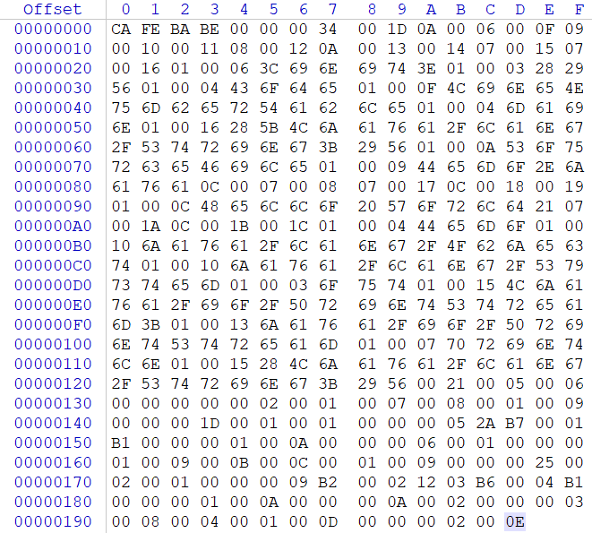

# 类文件结构

## Class类文件的结构

任何一个Class文件都对应着唯一一个类或接口的定义信息，但类和接口并不一定都得定义在文件里（譬如类或接口也可以通过类加载器直接生成）。通俗地将任意一个有效的类或接口所应当满足的格式称为“Class文件格式”，实际上它不一定以磁盘文件的形式存在。

Class文件是一组以8字节为基础单位的二进制流，各个数据项目严格按照顺序紧凑地排列在Class文件之中，中间没有添加任何分隔符。当遇到需要占用8字节以上空间的数据项时，则会按照高位在前的方式分割成若干个8为字节进行存储。**在字节码结构中，只有两种数据类型：无符号数和表**。

**无符号数属于基本的数据类型**。以u1、u2、u4、u8来分别代表1个字节、2个字节、4个字节和8个字节的无符号数，无符号数可以用来描述数字、索引引用、数量值或者按照UTF-8编码构成字符串值。

**表是由多个无符号数或者其他表作为数据项构成的复合数据类型**。所有表都习惯性地以“_info”结尾。表用于描述有层次关系的复合结构的数据，整个Class文件本质上就是一张表。

Class文件数据项：

|       类型       |         名称          |          数量           |   解释    |
| :------------: | :-----------------: | :-------------------: | :-----: |
|       u4       |        magic        |           1           |   魔数    |
|       u2       |    minor_version    |           1           |  次版本号   |
|       u2       |    major_version    |           1           |  主版本号   |
|       u2       | constant_pool_count |           1           | 常量池常量个数 |
|    cp_info     |    constant_pool    | constant_pool_count-1 |   常量池   |
|       u2       |    access_flags     |           1           |  访问标记   |
|       u2       |     this_class      |           1           |   类索引   |
|       u2       |     super_class     |           1           |  父类索引   |
|       u2       |  interfaces_count   |           1           | 接口索引数量  |
|       u2       |     interfaces      |   interfaces_count    |   接口表   |
|       u2       |    fields_count     |           1           | 字段表字段数量 |
|   field_info   |       fields        |     fields_count      |   字段表   |
|       u2       |    methods_count    |           1           | 方法表方法数量 |
|  method_info   |       methods       |     methods_count     |   方法表   |
|       u2       |  attributes_count   |           1           | 属性表属性数量 |
| attribute_info |     attributes      |   attributes_count    |   属性表   |

Class的结构不想XML等描述语言，由于它没有任何分隔符号，所以上述表的数据项，无论是顺序还是数量，甚至于数据存储字节序，都是被严格限定的，哪个字节代表什么含义，长度是多少，先后顺序如何，都不允许改变。

可以通过一个简单的例子对字节码文件进行分析：

```java
public class Demo {
	public static void main(String args[]) {
		System.out.println("Hello World!");
	}
}
```

生成的字节码文件用十六进制编辑器打开：



### 1.魔数与Class文件的版本

Class文件的1-4个字节称为魔数（Magic Number），它的唯一作用是确定这个文件是否为一个能被虚拟机接受的Class文件。其固定值是：0xCAFEBABE（咖啡宝贝）。如果一个Class文件的魔数不是0xCAFEBABE，那么虚拟机将拒绝运行这个文件。

Class文件的5-6个字节称为次版本号（Minor Version），即编译该Class文件的JDK次版本号。

Class文件的7-8个字节称为主版本号（Major Version），即编译该Class文件的JDK主版本号。

Java的版本号是从45（JDK1.0）开始的，JDK1.1之后每个JDK大版本发布主版本号向上加1。高版本JDK能向下兼容以前版本的Class文件，但不能运行以后版本的Class文件，即使文件格式并未发生任何变化，虚拟机也必须拒绝执行超过其版本号的Class文件。下表列出了各个版本JDK的十六进制版本号：

| JDK版本  | 次版本号 | 主版本号 | 十进制  |
| :----: | :--: | :--: | :--: |
| JDK1.1 | 0000 | 002D |  45  |
| JDK1.2 | 0000 | 002E |  46  |
| JDK1.3 | 0000 | 002F |  47  |
| JDK1.4 | 0000 | 0030 |  48  |
| JDK1.5 | 0000 | 0031 |  49  |
| JDK1.6 | 0000 | 0032 |  50  |
| JDK1.7 | 0000 | 0033 |  51  |
| JDK1.8 | 0000 | 0034 |  52  |

根据十六进制0xCAFEBABE，0x0000，0x0034可以知道，这个Class文件是由JDK1.8编译的。

### 2.常量池

紧接着主次版本号之后的是常量池入口，常量池可以理解为Class文件之中的资源仓库，它是Class文件结构中与其他项目关联最多的数据类型，也是占用Class文件空间最大的数据项目之一。

由于常量池中常量的数量是不固定的，所以在常量池的入口需要一项u2类型的数据，代表常量池容量计数器（constant_pool_count）。

与Java中语言习惯不一样的是，这个容量计数是从1而不是0开始。由本次Class文件9-10位十六进制数0x001D，即十进制29，这代表常量池中有28项常量，索引值范围为1-28。

**Class文件结构中只有常量池的容量计数是从1开始，对于其他集合类型，包括接口索引集合、字段表集合、方法表集合等的容量计数都是从0开始的。**

常量池的常量都是由cp_info这种表结构组成的，而且表结构不同其大小也不同。在Java虚拟机规范中一共有14种cp_info类型的表结构。

|                类型                |  标志  |      描述      |
| :------------------------------: | :--: | :----------: |
|        CONSTANT_Utf8_info        |  1   | UTF-8编码的字符串  |
|      CONSTANT_Integer_info       |  3   |    整型字面量     |
|       CONSTANT_Float_info        |  4   |    浮点型字面量    |
|        CONSTANT_Long_info        |  5   |    长整型字面量    |
|       CONSTANT_Double_info       |  6   |  双精度浮点型字面量   |
|       CONSTANT_Class_info        |  7   |  类或接口的符号引用   |
|       CONSTANT_String_info       |  8   |   字符串类型字面量   |
|      CONSTANT_Fieldref_info      |  9   |   字段的符号引用    |
|     CONSTANT_Methodref_info      |  10  |  类中方法的符号引用   |
| CONSTANT_InterfaceMethodref_info |  11  |  接口中方法的符号引用  |
|    CONSTANT_NameAndType_info     |  12  | 字段或方法的部分符号引用 |
|    CONSTANT_MethodHandle_info    |  15  |    表示方法句柄    |
|     CONSTANT_MethodType_info     |  16  |    标识方法类型    |
|   CONSTANT_InvokeDynamic_info    |  18  | 表示一个动态方法调用点  |

之所以说常量池是最烦琐的数据，是因为这14种常量类型各自均有自己的结构，但是有一个共同的特点，就是表开始的第一位是一个u1类型的标志位（tag）。对应的数据结构如下所示：

|                常量                |            项目            |        类型        |  描述  |
| :------------------------------: | :----------------------: | :--------------: | :--: |
|   <br/>CONSTANT_Utf8_info<br/>   | tag<br/>length<br/>bytes | u1<br/>u2<br/>u1 |      |
|      CONSTANT_Integer_info       |                          |                  |      |
|       CONSTANT_Float_info        |                          |                  |      |
|        CONSTANT_Long_info        |                          |                  |      |
|       CONSTANT_Double_info       |                          |                  |      |
|       CONSTANT_Class_info        |                          |                  |      |
|       CONSTANT_String_info       |                          |                  |      |
|      CONSTANT_Fieldref_info      |                          |                  |      |
|     CONSTANT_Methodref_info      |                          |                  |      |
| CONSTANT_InterfaceMethodref_info |                          |                  |      |
|    CONSTANT_NameAndType_info     |                          |                  |      |
|    CONSTANT_MethodHandle_info    |                          |                  |      |
|     CONSTANT_MethodType_info     |                          |                  |      |
|   CONSTANT_InvokeDynamic_info    |                          |                  |      |


