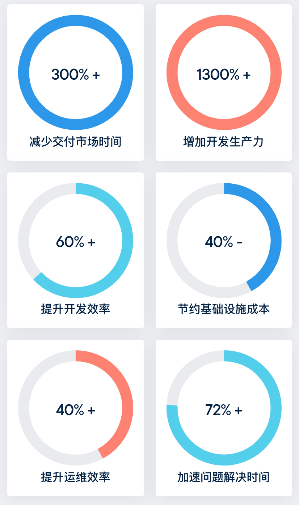
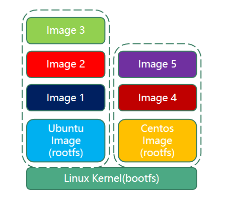
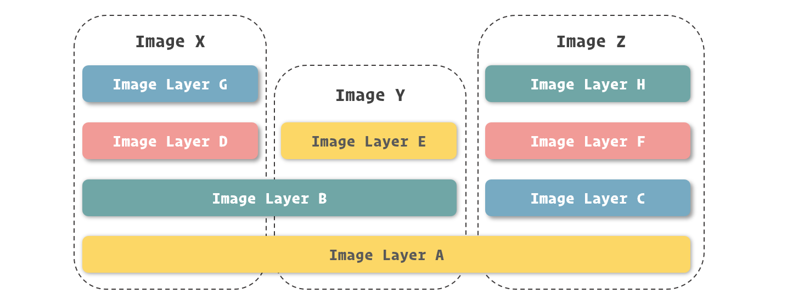
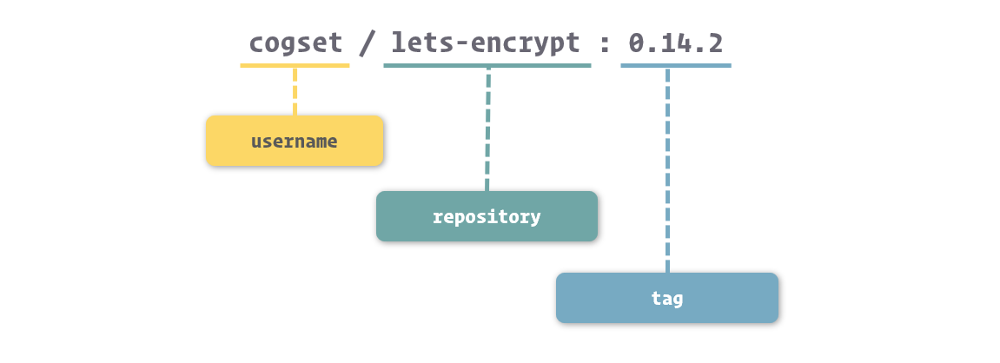
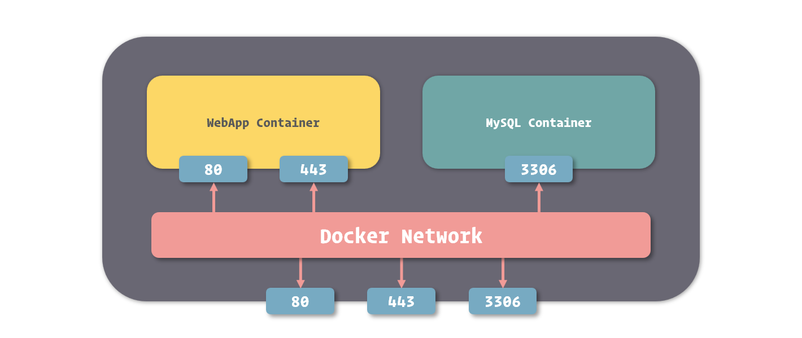

# Docker基础

## 什么是Docker

Docker是基于容器虚拟化技术、go语言实现的开源容器项目。可以轻松的为任何应用创建一个轻量级的、可移植的、自给自足的容器。

简单的讲，可以将Docker容器理解为一种轻量级的沙盒。每个容器内运行着一个应用，不同的容器相互隔离，容器之间也可以通过网络相互通信。容器的创建和停止十分快速，几乎跟创建和终止原生应用一致；另外，容器自身对系统资源的额外要求也十分有限，远远低于传统虚拟机。甚至直接把容器当作应用本身也没有任何问题。

Docker的构想是要实现“Build，Ship and Run Any App，Anywhere”，即通过对应用的封装、分发、部署、运行生命周期进行管理，达到应用组件级别的“一次封装，到处运行”。这里的应用组件，既可以是一个Web应用、一个编译环境，也可以是一套数据库平台服务，甚至是一个操作系统或集群。

## 为什么使用Docker

随着互联网的急速发展，应用的开发逐渐趋向于微服务化。每个应用程序都有其对应以来的操作系统或者其他程序，而在将应用程序细分为不同的微服务后，解决这种以来问题会愈发显得棘手。有的应用运行环境特别复杂，搭建过程也极易出错，这都是让开发、测试、运维人员头疼的地方。

而Docker提供了一种便利的方式，通过容器来打包应用、解耦应用和运行平台。这意味着迁移的时候，只需要再新的服务器上启动需要的容器就可以了，无论新旧服务器时候是同一类型的平台。

### Docker在开发和运维中的优势

 

Docker官方对Docker在工作上带来的提升做了调查研究，分别从工作效率的提升和技术设计投入的减少等方面数据化了Docker所做出的贡献。

具体来说，在开发和运维过程中，Docker具有如下几个方面的优势：

- 更快速的交付和部署。

使用Docker，开发人员可以使用镜像来快速构建一套标准的开发环境；开发完成之后，测试和运维人员可以直接使用完全相同的环境来部署代码。只要是开发测试过的代码，就可以确保在生产环境无缝运行。Docker可以快速创建和删除容器，实现快速迭代，节约开发、测试、部署的大量时间。并且，整个过程全程可见，使团队更容易理解应用的创建和工作过程。

- 更高效的资源利用。

运行Docker容器不需要额外的虚拟化管理程序的支持，Docker是内核级的虚拟化，可以实现更高的性能，同时对资源的额外需求很低。与传统虚拟机方式相比，Docker的性能要提高1~2个数量级。

- 更轻松的迁移和扩展。

Docker容器几乎可以在任意的平台上运行，包括物理机、虚拟机、公有云、私有云、个人电脑、服务器等，同时支持主流的操作系统发行版本。这种兼容性让用户可以在不同平台之间轻松的迁移应用。

- 更简单的更新管理。

使用Dockerfile，只需要小小的配置修改，就可以替代以往大量的更新工作。所有的修改都以增量的方式被分发和更行，从而实现自动化并且高效的容器管理。

### Docker与虚拟机的比较


容器是应用层的抽象，它将代码和依赖关系打包在一起。多个容器可以在同一台机器上运行，并与其他容器共享操作系统内核，每个容器在用户空间中作为**独立进程**运行。容器占用的空间比VM少（容器镜像的大小通常位几十MB），可以用更少的VM和操作系统，处理更多的应用程序。


虚拟机（VM）是物理硬件的抽象，将一台服务器转变为多台服务器。虚拟机管理程序允许多台虚拟机在一台计算机上运行。每个VM都包含**操作系统的完整副本、应用程序、必要的二进制文件和库**，占用数十GB。虚拟机启动很慢。

由上可以看出，虚拟机是在硬件层面实现虚拟化，需要有额外的虚拟机管理程序管理应用和虚拟机操作系统层。Docker容器是在操作系统层面上实现虚拟化，直接复用本地主机的操作系统，因此更加轻量级。

|  特性  |    容器     |  虚拟机  |
| :--: | :-------: | :---: |
| 启动速度 |    秒级     |  分钟级  |
|  性能  |   接近原生    |  较弱   |
| 内存代价 |    很小     |  较多   |
| 硬盘使用 |   一般为MB   | 一般为GB |
| 运行密度 | 单机支持上千个容器 | 一般几十个 |
| 隔离性  |   安全隔离    | 完全隔离  |
| 迁移性  |    优秀     |  一般   |

## 安装

### Docker Engine 的版本

在安装 Docker 之前，我们先来了解一下 Docker 的版本定义，这有利于我们在之后的开发中选择和使用合适的 Docker 版本。

对于 Docker Engine 来说，其主要分为两个系列：

- 社区版 ( CE, Community Edition )
- 企业版 ( EE, Enterprise Edition )

社区版 ( Docker Engine CE ) 主要提供了 Docker 中的容器管理等基础功能，主要针对开发者和小型团队进行开发和试验。而企业版 ( Docker Engine EE ) 则在社区版的基础上增加了诸如容器管理、镜像管理、插件、安全等额外服务与功能，为容器的稳定运行提供了支持，适合于中大型项目的线上运行。

社区版和企业版的另一区别就是免费与收费了。对于我们开发者来说，社区版已经提供了 Docker 所有核心的功能，足够满足我们在开发、测试中的需求，所以我们直接选择使用社区版进行开发即可。

### CentOs

``` shell
sudo yum install yum-utils device-mapper-persistent-data lvm2

sudo yum-config-manager --add-repo https://download.docker.com/linux/centos/docker-ce.repo
sudo yum install docker-ce

sudo systemctl enable docker
sudo systemctl start docker
```

### 其他

<https://docs.docker.com/>

配置文件官方地址：<https://docs.docker.com/engine/reference/commandline/dockerd/#daemon-configuration-file>

## Docker核心概念

### Docker镜像

Docker本质上是一个运行在Linux操作系统上的应用，而Linux操作系统分为内核和用户空间，无论是CentOS还是Ubuntu，都是在启动内核之后，通过挂载Root文件系统来提供用户空间的，而Docker镜像就是一个Root文件系统。

Docker镜像是一个特殊的文件系统，提供容器运行时所需的程序、库、资源、配置等文件，另外还包含了一些为运行时准备的一些配置参数（如匿名卷、环境变量、用户等）。



**镜像不包含任何动态数据，其内容在构建之后也不会被改变**。

Docker镜像可以通过分层来进行继承。用户基于基础镜像来制作各种不同的应用镜像。这些镜像共享同一个基础镜像层，提高了存储效率。当用户改变了一个Docker镜像，则会创建一个新的层。因此，用户不用替换整个原镜像或者重新建立，只需要添加新层即可。用户分发镜像的时候，也只需要分发被改动的新层内容。



官方国内镜像源：[registry.docker-cn.com](https://registry.docker-cn.com/)

### Docker容器

镜像（Image）和容器（Container）的关系，就像面向对象程序设计中的类和实例一样，镜像是静态的定义，容器是镜像运行时的实体。容器可以被创建、启动、停止、删除、暂停等。

容器的实质时进程，但与直接在宿主执行的进程不同，容器进程运行于属于自己的独立的命名空间。因此容器可以拥有自己的root文件系统、自己的网络配置、自己的进程空间，甚至自己的用户ID空间。容器内的进程是运行在一个隔离的环境里，使用起来，就好像是在一个独立于宿主的系统下操作一样。这种特性使得容器封装的应用比直接在宿主运行更加安全。

镜像使用的是分层存储，容器也是如此。每一个容器运行时，是以镜像为基础层，在其上创建一个当前容器的存储层，可以称这个为容器运行时读写而准备的存储层为**容器存储层**。

**容器存储层的生存周期和容器一样，容器消亡时，容器存储层也随之消亡。因此，任何保存于容器存储层的信息都会随容器的删除而丢失。**

### Docker仓库

镜像构建完成后，可以很容易的在当前宿主机上运行，但是，如果需要在其它服务器上使用这个镜像，我们就需要一个集中的存储、分发镜像的服务，Docker Registry就是这样的服务。

一个 Docker Registry 中可以包含多个仓库（ Repository ）；每个仓库可以包含多个标签（ Tag ）；每个标签对应一个镜像。



镜像的命名我们可以分成三个部分：**username**、**repository** 和 **tag**。

- **username**： 主要用于识别上传镜像的不同用户，与 GitHub 中的用户空间类似。
- **repository**：主要用于识别进行的内容，形成对镜像的表意描述。
- **tag**：主要用户表示镜像的版本，方便区分进行内容的不同细节

## 基本用法

### 获取镜像

pull命令直接从Docker Hub镜像源来下载镜像：

```shell
docker [image] pull NAME[:TAG]
```

### 查看镜像信息

使用images命令列出镜像：

```shell
docker images 或 docker image ls
```

使用tag命令来为本地镜像任意添加新的标签：

```shell
docker tag ubuntu:latest myubuntu:test
```

myubuntu:test镜像ID跟ubuntu:latest是完全一致的，他们实际上指向了同一个镜像文件，只是别名不同而已。tag命令添加的标签实际上起到了类似链接的作用。

使用inspect命令查看详细信息，包括制作者、适应架构、各层的数字摘要等：

```shell
docker [image] inspect ubuntu:latest
```

使用history命令查看镜像历史：

```shell
docker history ubuntu:latest
```

### 搜寻镜像

使用search命令可以搜索仓库中的镜像：

```shell
docker search [option] keyword
```

返回包含关键字的镜像，其中包括镜像名字、描述、收藏数（表示该镜像的受欢迎程度）、是否官方创建、是否自动创建等。

### 删除和清理镜像

使用rm命令可以删除镜像：

```shell
docker rmi IMAGE [IMAGE...] 或 docker image rm IMAGE [IMAGE...]
```

- -f，-force：强制删除镜像，即使有容器依赖它

使用Docker一段时间后，系统中可能会遗留一些临时的镜像文件，以及一些没有被使用的镜像，可以使用prune命令进行清理：

```shell
docker image prune
```

- -f，-force：强制删除镜像，而不进行提示确认

### 存出和载入镜像

存出镜像：

```shell
docker [image] save [-o|--output[=""]] IMAGE
```

可以通过-o选项来指定导出的tar文件名，也可以通过重定向来实现。

载入镜像：

```shell
docker [image] load -i IMAGE.tar
```

-i选项从指定的文件中读入镜像。

### 上传镜像

使用push命令可以上传镜像到仓库：

```shell
docker [image] push NAME[:TAG] | [REGISTRY_HOST[:REGISTRY_PORT]/]NAME[:TAG]
```

### 创建容器

使用create命令新建一个容器：

```shell
docker [container] create ubuntu:latest
```

使用start命令来启动一个容器：

```shell
docker [container] start CONTAINER
```

使用run命令来创建并启动一个容器：

```shell
docker [container] run ubuntu:latest
```

允许用户交互，exit退出：

```shell
docker [container] run -it ubuntu:latest /bin/bash
```

更多的时候，需要让Docker容器在后台以守护态（Daemonized）形式运行。可以通过添加-d参数来实现：

```shell
docker [container] run -d ubuntu:latest
```

某些时候，执行run命令的时候因为命令无法正常执行容器会出错直接退出，此时可以查看退出的错误代码，常见包括：

- 125：Docker daemon执行出错，例如指定了不支持的Docker参数
- 126：所指定命令无法执行，例如权限出错
- 127：容器内命令无法找到

使用logs命令获取容器的输出信息：

```shell
docker [container] logs containerID
```

### 停止容器

使用pause命令暂停运行的容器：

```shell
docker [container] pause CONTAINER [CONTAINER...]
```

使用unpause命令恢复处于paused状态的容器到运行状态：

```shell
docker [container] unpause CONTAINER [CONTAINER...]
```

使用stop命令终止运行中的容器：

```shell
docker [container] stop [-t|--time[=10]] CONTAINER [CONTAINER...]
```

该命令会首先向容器发送SIGTERM信号，等待一段超时时间后（默认为10秒），再发送SIGKILL信号来终止容器。

此外，还可以通过docker [container] kill直接发送SIGTERM信号来强行终止容器。

使用prune命令自动清除掉所有处于停止状态的容器：

```shell
docker container prune
```

### 进入容器

使用exec命令与容器进行交互：

```shell
docker [container] exec -it CONTAINER /bin/bash
```

-i，--interactive=true|false：打开标准输入接受用户输入命令，默认值为false

-t，--tty=ture|false：分配伪终端，默认值为false

### 删除容器

使用rm命令删除处于终止或退出状态的容器：

```shell
docker [container] rm CONTAINER [CONTAINER...]
```

默认情况下，docker rm命令只能删除已经处于终止或退出状态的容器，并不能删除还处于运行状态的容器。

-f，--force=false：是否强行终止并删除一个运行中的容器

-l，--link=false：删除容器的连接，但保留容器

-v，--volumes=false：删除容器挂载的容器

## 重要组成

### Docker网络功能

#### 容器网络模型


容器网络模型包括三种基本元素：

- 沙盒（Sandbox）：代表一个容器，准确的说，是其网络命名空间；
- 接入点（Endpoint）：代表网络上可以挂载容器的接口，会分配IP地址；
- 网络（network）：可以连通多个接入点的一个子网。

#### 网络启动过程

Docker服务启动时会首先在主机上自动创建一个docker0虚拟网桥，实际上是一个Linux网桥。网桥可以理解为一个软件交换机，负责挂载其上的接口之间进行包转发。同时，Docker随机分配一个本地为占用的私有网段中的一个地址给docker0接口。此后启动的容器内的网口也会自动分配一个该网段的地址。

当创建一个Docker容器的时候，同时会创建一对veth pair互联接口。互联端口的一端位于容器内，即eth0；另一端在本地并被挂载到docker0网桥，名称以veth开头。通过这种方式，主机可以与容器通信，容器之间也可以相互通信。如此一来，Docker就创建了在主机和所有容器之间一个虚拟共享网络。

#### 网络驱动

目前 Docker 官方为我们提供了五种 Docker 网络驱动，分别是：**Bridge Driver**、**Host Driver**、**Overlay Driver**、**MacLan Driver**、**None Driver**。

其中，Bridge 网络是 Docker 容器的默认网络驱动，简而言之其就是通过网桥来实现网络通讯。而 Overlay 网络是借助 Docker 集群模块 Docker Swarm 来搭建的跨 Docker Daemon 网络，我们可以通过它搭建跨物理主机的虚拟网络，进而让不同物理机中运行的容器感知不到多个物理机的存在。

``` shell
docker network --help
```

#### 端口映射

当启动容器的时候，如果不指定对应参数，在容器外部时无法通过网络来访问容器内的网络应用的。

可以通过`-P`或`-p`参数指定端口映射。当使用`-P`标记时，Docker会随机映射一个49000~49900端口到内部容器开放的网络端口。



#### 容器互联

容器互联是一种让多个容器种的应用进行快速交互的方式。他会在源和接收容器之间创建连接关系，接收容器可以通过容器名快速访问到源容器，而不用指定具体的IP地址。

可以使用`--link name:alias`选项链接容器。

Docker会更新/etc/hosts文件记录容器域名和IP地址。

### Docker数据管理

#### 数据持久化

使用Docker的时候，往往需要对数据进行持久化，或者需要在多个容器之间进行数据共享，这必然设计容器的数据管理操作。

容器中管理数据主要有三种方式：

- Bind mount：能够直接将宿主操作系统中的目录和文件挂载到容器内的文件系统中，通过指定容器外的路径和容器内的路径，就可以形成挂载映射关系，在容器内外对文件的读写，都是相互可见的；
- Volume：也是从宿主操作系统中挂载目录到容器内，只不过这个挂载的目录由 Docker 进行管理，我们只需要指定容器内的目录，不需要关心具体挂载到了宿主操作系统中的哪里；
- Tmpfs Mount： 支持挂载系统内存中的一部分到容器的文件系统里，不过由于内存和容器的特征，它的存储并不是持久的，其中的内容会随着容器的停止而消失。

##### Bind mount

在创建容器的时候可以传递-v/--vloume或者-mount选项来指定容器内外的挂载路径。

`-v <host-path>:<container-path>` 或 `--volume <host-path>:<container-path>`

`-mount type=<type>,source=<source>,destination=<destination>`

-moun选项支持三种类型数据卷：

- volume：普通数据卷，映射到主机/var/lib/docker/volumes路径下
- bind：映射到主机指定路径下
- tmpfs：临时数据卷，只存在于内存中

##### 数据卷（Data Volumes）

数据卷是一个可供容器使用的特殊目录，他将主机操作系统目录直接映射进容器，类似于Linux中mount行为。

数据卷可以提供很多有用的特性：

- 数据卷可以在容器之前共享和重用，容器间传递数据将变得高效与方便；
- 对数据卷内数据的修改会立马生效，无论是容器内操作还是本地操作；
- 对数据卷的更新不会影响镜像，解耦开应用和数据；
- 卷会一直存在，直到没有容器使用他，可以安全的卸载他。


``` shell
docker volume --help
```


##### 数据卷容器（Data Volume Containers）

如果用户需要在多个容器之间共享一些持续更新的数据，最简单的方式是使用数据卷容器。数据卷容器也是一个容器，甚至不需要运行的容器，但是他的目的是定义一个或多个数据卷并持有它们的引用并提供给其他容器挂载。

引用数据卷容器时，不需要再定义数据卷挂载到容器中的位置，Docker 会以数据卷容器中的挂载定义将数据卷挂载到引用的容器中。

虽然看上去数据卷容器与数据卷的使用方法变化不大，但最关键的就在于其真正隐藏了数据卷的配置和定义，我们只需要通过数据卷容器的名称来使用它。这些细节的隐藏，意味着我们能够更轻松的实现容器的迁移。

``` shell
docker create -v /var/lib/mysql --name db ubuntu
docker run --volumes-from db --name mymysql mysql:5.7
```

##### Tmpfs

Tmpfs Mount 是一种特殊的挂载方式，它主要利用内存来存储数据。由于内存不是持久性存储设备，所以其带给 Tmpfs Mount 的特征就是临时性挂载。

`--tmpfs <destination>`

#### 备份和迁移数据卷

如果使用目录挂载对容器数据进行持久化，可以直接在宿主主机的对应目录下对数据文件进行备份和迁移。

如果使用数据卷或者数据卷容器对容器数据进行的持久化，需要通过临时容器将数据卷或者数据卷容器中存储的数据进行备份。

- 数据卷迁移过程

``` shell
# 运行一个mysql并挂载数据卷
docker run -d -p 3306:3306 --name mysqla -v mysqla:/var/lib/mysql -e MYSQL_ROOT_PASSWORD mysql:5.7
# 将持久化数据压缩并挂载到宿主机
docker run --rm -v mysqla:/db -v $(pwd):/data --name demo ubuntu tar cvf /data/mysql.tar /db
# 数据迁移
# 数据目标主机将压缩文件解压并挂载数据卷
docker run --name demo1 -v $(pwd):/data -v mysqlb:/db ubuntu tar xvf /data/mysql.tar
# 运行一个mysql并挂载数据卷
docker run -d -p 3306:3306 --name mysqlb -v mysqlb:/var/lib/mysql -e MYSQL_ROOT_PASSWORD mysql:5.7
```

- 数据卷容器迁移过程

``` shell
# 创建一个数据卷容器
docker create -v /data --name db ubuntu
# 运行一个redis并挂载数据卷容器
docker run -d --name redisa --volumes-from db -p 6379:6379 redis
# 将数据卷容器中的持久化数据打包
docker run --volumes-from db -v $(pwd):/redis --name demo0 ubuntu tar cvf /redis/redis.tar /data
# 数据迁移
# 数据目标主机创建一个数据卷容器
docker create -v /data --name db1 ubuntu
# 将压缩文件解压并挂载数据卷容器
docker run --volumes-from db1 -v $(pwd):/db ubuntu tar xvf /db/redis.tar
# 运行一个redis并挂载数据卷容器
docker run -d --name redisb -p 6379:6379 --volumes-from db1 redis
```

## Docker构建镜像

### commit命令

启动一个容器并在容器内做出了修改，可以使用commit命令构建新的镜像。

``` shell
docker [container] commit
```

### import命令

可以直接从一个操作系统模板文件导入一个镜像。

``` shell
docker [image] import
```

### Dockerfile

Dockerfile是一个文本格式的配置文件，用户可以使用Dockerfile来快速创建自定义的镜像。

### 指令说明

|  分类  |     指令      |        说明         |
| :--: | :---------: | :---------------: |
| 配置指令 |     ARG     |  定义创建镜像过程中使用的变量   |
| 配置指令 |    FROM     |   指定所创建镜像的基础镜像    |
| 配置指令 |    LABEL    |  为生成的镜像添加元数据标签信息  |
| 配置指令 |   EXPOSE    |   声明镜像内服务监听的端口    |
| 配置指令 |     ENV     |      指定环境变量       |
| 配置指令 | ENTRYPOINT  |    指定镜像的默认入口命令    |
| 配置指令 |   VOLUME    |    创建一个数据卷挂载点     |
| 配置指令 |    USER     |  指定运行容器时的用户名或UID  |
| 配置指令 |   WORKDIR   |      配置工作目录       |
| 配置指令 |   ONBUILD   | 创建子镜像时指定自动执行的操作指令 |
| 配置指令 | STOPSIGNAL  |     指定退出的信号值      |
| 配置指令 | HEALTHCHECK |  配置所启动容器如何进行健康检查  |
| 配置指令 |    SHELL    |   指定默认的shell类型    |
| 操作指令 |     RUN     |      运行指定命令       |
| 操作指令 |     CMD     |  启动容器时指定默认执行的命令   |
| 操作指令 |     ADD     |      添加内容到镜像      |
| 操作指令 |    COPY     |      复制内容到镜像      |

编写完成Dockerfile之后，可以通过`docker [image] build`命令创建镜像。

## 谈谈Docker

### 开发人员怎么看待容器

- 快速上手新技术
- 容器化的代码仓库提升开发效率

### CICD和DevOps

