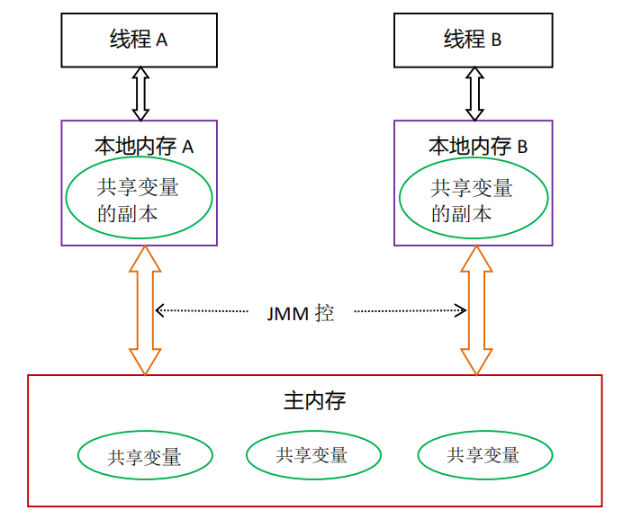
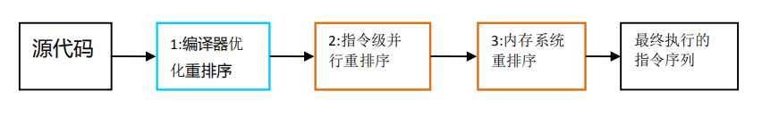

# Java内存模型

## 并发编程模型的分类

并发编程中，需要考虑两个问题：线程之间如何通信及线程之间如何同步。

- 通信是指线程之间以何种机制来交换信息。
- 同步是指程序用于控制不同线程之间操作发生相对顺序的机制。

在命令式编程中，线程之间的通信机制有两种：**共享内存和消息传递**。

Java的并发采用的是共享内存模型，Java线程之间通过写-读内存中的公共状态来隐式进行通信，整个通信过程对程序员完全透明。如果编写多线程程序的Java程序员不理解隐式进行的线程之间通信的工作机制，很可能会遇到各种奇怪的内存可见性问题。

## Java内存模型的抽象

在Java中，所有实例域、静态域和数组元素存储在堆内存中，堆内存在线程之间共享，有内存可见性的问题。局部变量、方法定义参数和异常处理器参数不会在线程之间共享，不会有内存可见性问题。

Java线程之间的通信由Java内存模型（简称JMM）控制，JMM决定了一个线程对共享变量的写入何时对另一个线程可见，从而为Java程序员提供内存可见性保证。

从抽象的角度看，JMM定义了线程和主内存之间的抽象关系：线程之间的共享变量存储在主内存中，每个线程都有一个私有的本地内存，本地内存存储了该线程以读/写共享变量的副本。

本地内存是JMM的抽象概念，不真实存在。它涵盖了缓存、写缓冲区、寄存器以及其他的硬件和编译器优化。

## 内存间的交互操作

### 8种基本操作

主内存与工作内存之间具体的交互协议，即一个变量如何从主内存拷贝到工作内存、如何从工作内存同步回主内存之类的实现细节，Java内存模型中定义了8种操作来完成，虚拟机实现时必须保证每一种操作都是原子的、不可再分的。

- lock（锁定）：作用于主内存的变量，它把一个变量标识为一条线程独占的状态。
- unlock（解锁）：作用于主内存的变量，它把一个处于锁定状态的变量释放出来，释放后的变量才可以被其他线程锁定。
- read（读取）：作用于主内存的变量，它把一个变量的值从主内存传输到线程的工作内存中，以便随后的load动作使用。
- load（载入）：作用于工作内存的变量，它把read操作从主内存中得到的变量值放入工作内存的变量副本中。
- use（使用）：作用于工作内存的变量，它把工作内存中的一个变量的值传递给执行引擎，每当虚拟机遇到一个需要使用到变量的值的字节码指令时将会执行这个操作。
- assign（赋值）：作用于工作内存的变量，它把一个从执行引擎接收到的值赋给工作内存的变量，每当虚拟机遇到一个给变量赋值的字节码指令时执行这个操作。
- store（存储）：作用于工作内存的变量，它把工作内存中一个变量的值传送到主内存中，以便随后的write操作使用。
- write（写入）：作用于主内存的变量，它把store操作从工作内存中得到的变量的值放入主内存的变量中。

### 8种基本操作规则

- 如果要把一个变量从主内存复制到工作内存，就要顺序的执行read和load操作，如果要把变量从工作内存同步回主内存，就要顺序的执行store和write操作。Java内存模型只要求上述两个操作必须按顺序执行，而没有保证是连续执行。
- 不允许read和load、store和write操作之一单独出现，即不允许一个变量从主内存读取了但工作内存不接受，或者从工作内存发起回写了但主内存不接受的情况出现。
- 不允许一个线程丢弃它的最近的assign操作，即变量在工作内存中改变了之后必须把该变化同步回主内存。
- 不允许一个线程无原因地（没有发生过任何assign操作）把数据从线程地工作内存同步回主内存中。
- 一个新的变量只能在主内存中产生，不允许在工作内存中直接使用一个未被初始化变量，也就是没有执行load或者assign操作。也就是说对一个变量实施use、store之前必须先执行过了load和assign操作。
- 一个变量在同一个时刻只允许一条线程对其进行lock操作，但lock操作可以被同一条线程重复执行多次，多次执行lock后，只有执行相同次数的unlock操作，变量才会被解锁。
- 如果对一个变量执行lock操作，那将会清空工作内存中此变量的值，在执行引擎使用这个变量前，需要重新执行load或assign操作初始化变量的值。
- 如果一个变量事先没有被lock操作锁定，那就不允许对它执行unlock操作，也不允许去unlock一个被其他线程锁定住的变量。
- 对一个变量执行unlock操作之前，必须先把此变量同步回主内存中，即执行store、write操作。

## 重排序

在执行程序时为了提高性能，编译器和处理器常常会对指令做重排序。重排序分三种类型：

- 编译器优化的重排序。编译器在不改变单线程程序语义的前提下，可以重新安排语句的执行顺序。
- 指令级并行重排序。现代处理器采用了指令级并行技术来讲多条指令重叠执行。如果不存在数据依赖性，处理器可以改变语句对应机器指令对的执行顺序。
- 内存系统的重排序。由于处理器使用缓存和读/写缓冲区，这使得加载和存储操作看上去可能实在乱序执行。

上述1属于编译器重排序，2和3属于处理器重排序。这些重排序都可能会导致多线程程序出现内存可见性问题。

对于编译器，JMM的编译器重排序规则会禁止特定类型的编译器重排序。对于处理器重排序，JMM的处理器重排序规则会要求Java编译器生成指令序列时，插入特定类型的内存屏障来禁止特定类型的处理器重排序。

## 内存屏障

为了保证内存可见性，Java编译器在生成指令序列的适当位置会插入内存屏障指令来禁止特定类型的处理器重排序。

JMM把内存屏障指令分为4类：

|        屏障类型         |           指令示例           |                    说明                    |
| :-----------------: | :----------------------: | :--------------------------------------: |
|  LoadLoad Barriers  |   Load1;LoadLoad;Load2   |     确保Load1数据的装载先于Load2及所有后续装载指令的装载      |
| StoreStore Barriers | Store1;StoreStore;Store2 | 确保Store1数据对其他处理器可见（刷新到主内存）先于Store2及所有后续存储指令的存储 |
| LoadStore Barriers  |  Load1;LoadStore;Store2  |    确保Load1数据装载先于Store2及所有后续的存储指令刷新到内存    |
| StoreLoad Barriers  |  Store1;StoreLoad;Load2  | 确保Store1数据对其他处理器变得可见（指刷新到内存）先于Load2及所有后续装载指令的装载。StoreLoad Barriers会使该屏障之前的所有内存访问指令（存储和装载指令）完成之后，才执行该屏障之后的内存访问指令 |

StoreLoad Barriers同时具有其他3个屏障的效果。执行该屏障开销会很昂贵，因为当前处理器通常要把写缓冲区中的数据全部刷新到内存中。

## happens-before

在JMM中，如果一个操作执行的结果需要对另一个操作可见，那么这两个操作之间必须要存在happens-before关系。这里提到的两个操作既可以实在一个线程之内，也可以在不同线程之间。

与程序员密切相关的happens-before规则如下：

- 程序顺序规则：一个线程中的每个操作，happens-before于该线程中对的任意后续操作。
- 监视器锁规则：对一个监视器的解锁，happens-before于随后对这个监视器的加锁。
- volatile变量规则：对一个volatile域的写，happens-before于任意后续对这个volatile域的读。
- 传递性：如果A happens-before B，且B happens-before C，那么A happens-before C。

- 线程启动规则：如果线程A执行操作ThreadB.start()（启动线程B），那么线程A的ThreadB.start()操作先行发生于线程B中的任意操作。
- 线程终止规则：如果线程A执行操作ThreadB.join()并成功返回，那么线程B中的任意操作先行发生于线程A从ThreadB.join()操作成功返回。
- 对象终结规则：一个对象的初始化完成（构造函数执行结束）先行发生于它的finalize()方法的开始。

注：两个操作之间具有happens-before关系，并不意味着前一个操作必须要在后一个操作之前执行。happens-before仅仅要求前一个操作执行结果对后一个 操作可见。

一个happens-before规则对应于一个或多个编译器和处理器重排序规则。

## 数据依赖性

如果两个操作访问同一个变量，且这两个操作中有一个为写操作，此时这两个操作之间就存在数据依赖性。

编译器和处理器不会改变存在数据依赖关系的两个操作的执行顺序。

注：这里所说的数据依赖性仅针对单个处理器中执行的指令序列和单个线程中执行的操作，不同处理器之间和不同线程之间的数据依赖性不被编译器和处理器考虑。

## as-if-serial语义

即时编译器和处理器需要保证程序能够遵守as-if-serial语义。通俗的说，就是在单线程情况下，要给程序一个顺序执行的假象。即经过重排序的执行结果要于顺序执行的结果保持一致。

如果两个操作之间存在数据依赖，那么即时编译器和处理器不能调整他们的顺序，否则将会造成程序语义的改变。

## 顺序一致性

当程序为正确同步时，就可能会存在数据竞争。

JMM规范对数据竞争的定义如下：

- 在一个线程中写一个变量
- 在另一个线程中读同一个变量
- 写和读没有通过同步来排序

如果一个多线程程序能正确同步，这个程序将是一个没有数据竞争的程序。JMM对正确同步的多线程程序的内存一致性做了如下保证：

如果程序是正确同步的，程序的执行结果与该程序在顺序一致性内存模型中的执行结果相同。

## 顺序一致性内存模型

顺序一致性内存模型是一个理想化的理论参考模型，它提供了极强的内存可见性保证。顺序一致性内存模型有两大特征：

- 一个线程中的所有操作必须按照程序的顺序执行
- 不管程序是否同步，所有线程都只能看到一个单一的操作执行顺序。每个操作都必须原子执行且立刻对所有线程可见

## volatile

### volatile的特性

volatile变量自身具有下列特性：

- 可见性：保证此变量对所有线程的可见性，这里的可见性是指当一条线程修改了这个变量的值，新值对于其他线程来说是可以立即得知的。
- 原子性：对任意单个volatile变量的读/写具有原子性，但类似于volatile++这种复合操作不具有原子性
- 禁止部分指令重排序优化：JMM会限制编译器重排序和处理器重排序。规则如下

|  是否能重排序  | 第二个操作 | 第二个操作 | 第二个操作 |
| :------------: | :--------: | :--------: | :--------: |
| **第一个操作** | 普通读/写  | volatile读 | volatile写 |
|   普通读/写    |            |            |     NO     |
|   volatile读   |     NO     |     NO     |     NO     |
|   volatile写   |            |     NO     |     NO     |

从上表可以看出：

1. volatile写之前的操作不会被编译器重排序到volatile写之后
2. volatile读之后的操作不会被编译器重排序到volatile读之前
3. 当第一个操作是volatile写，第二个操作是volatile读时，不能重排序

### volatile内存语义实现

- 在每个volatile写操作的前面插入一个StoreStore屏障

  StoreStore禁止上面的普通写和下面的volatile写重排序

- 在每个volatile写操作的后面插入一个StoreLoad屏障

  StoreLoad防止上面的volatile写与下面可能有的volatile读/写重排序

- 在每个volatile读操作的后面插入一个LoadLoad屏障

  LoadLoad禁止下面所有的普通读操作和上面的volatile读重排序

- 在每个volatile读操作的后面插入一个LoadStore屏障

  LoadStore禁止下面所有的普通写操作和上面的volatile读重排序

### volatile写-读内存语义

- volatile写内存语义：当写一个volatile变量时，JMM会把该线程对应的本地内存中的共享变量值刷新到主内存。
- volatile读内存语义：当读一个volatile变量时，JMM会把该线程对应的本地内存置为无效。线程接下来将从主内存中读取共享变量。

从内存语义的角度来说，volatile的写-读与锁的释放-获取有相同的内存效果。volatile写和锁的释放具有相同的内存语义；volatile读与锁的获取有相同的内存语义。

### 在众多并发安全的工具中选择volatile的意义

volatile变量读操作的性能消耗与普通变量几乎没有什么差别，但是写操作则可能会慢一些，因为它需要在本地代码中插入许多内存屏障指令来保证处理器不发生乱序执行。不过即便如此，大多数场景下volatile的总开销仍然要比锁低，在volatile与锁之中选择的唯一依据仅仅是volatile的语义能否满足使用场景的要求。

## 锁

### 锁的释放和获取的内存语义

- 当线程释放锁时，JMM会把该线程对应的本地内存中的共享变量刷新到主内存中
- 当线程获取锁时，JMM会把该线程对应的本地内存置为无效。从而使得被监视器保护的临界区代码必须从主内存中读取共享变量

### 锁内存语义的实现

锁的实现依赖于Java同步器框架AbstractOueuedSynchronizer。AQS使用一个整型的volatile变量（命名为state）来维护同步状态，这个volatile变量是锁内存语义实现的关键。

通过ReentrantLock的公平锁和非公平锁的实现可以获得如下结论：

- 当线程获取锁时，加锁方法首先读volatile变量state

  当读一个volatile变量时，JMM会把该线程对应的本地内存置为无效。线程接下来将从主内存中读取共享变量。

- 当线程释放锁时，

  1. 公平锁在释放锁的最后写volatile变量state

     当写一个volatile变量时，JMM会把该线程对应的本地内存中的共享变量值刷新到主内存。

  2. 非公平锁以CAS操作的方式更新state变量

     JDK文档对该方法的说明如下：如果当前状态值等于预期值，则以原子方式将同步状态设置为给定的更新值。**此操作具有volatile读和写的内存语义**。

     CAS操作是Unsafe类中native方法，该方法禁止该指令与之前和之后的读和写指令重排序，把写缓冲区中的所有数据刷新到内存中，所以该方法同时实现volatile读和写的内存语义。

对公平锁和非公平锁的内存语义总结：

- 公平锁和非公平锁释放时，最后都要写一个volatile变量state
- 公平锁获取时，首先去读volatile变量
- 非公平锁获取时，首先会用CAS更新volatile变量，这个操作同时具有volatile读和写的内存语义

### concurrent包的实现

 Java线程之间的通信有四种方式：

1. A线程写volatile变量，随后B线程读这个volatile变量
2. A线程写volatile变量，随后B线程用CAS更新这个volatile变量
3. A线程用CAS更新一个volatile变量，随后B线程用CAS更新这个volatile变量
4. A线程用CAS更新一个volatile变量，随后B线程读这个volatile变量

## final域的内存语义

- 在构造函数内对一个final域的写入，与随后把这个被构造对象的引用赋值给一个引用变量，这两个操作之间不能重排序
- 初次读一个包含final域的对象的引用，与随后初次读这个final域，这两个操作之间不能重排序
- 在构造函数内对一个final引用的对象的成员域的写入，与随后在构造函数外把这个被构造对象的应用赋值给一个引用变量，这两个操作之间不能重排序

## 针对long和double型变量的特殊规则    

Java内存模型要求lock、unlock、read、load、assign、use、store、write这八种操作都具有原子性，但是对于64位的数据类型（long和double） ，在模型中特别定义了一条宽松的规定：允许虚拟机将没有被volatile修饰的64位数据的读写操作划分为两次32位的操作来进行，即允许虚拟机实现自行选择是否要保证64位数据类型的load、store、read和write这四个操作的原子性，这就是所谓的“long和double的非 原子性协定”。

## 原子性、可见性与有序性

JMM是围绕着在并发过程中如何处理原子性、可见性和有序性这三个特征来建立的。

### 原子性

由Java内存模型来直接保证的原子性变量操作包括read、 load、 assign、 use、 store和write这六个， 我们大致可以认为， 基本数据类型的访问、 读写都是具备原子性的。

 如果应用场景需要一个更大范围的原子性保证（经常会遇到） ， Java内存模型还提供了lock和 unlock操作来满足这种需求， 尽管虚拟机未把lock和unlock操作直接开放给用户使用， 但是却提供了更 高层次的字节码指令monitorenter和monitorexit来隐式地使用这两个操作。 这两个字节码指令反映到Java 代码中就是同步块——synchronized关键字， 因此在synchronized块之间的操作也具备原子性。

### 可见性

可见性就是指当一个线程修改了共享变量的值时， 其他线程能够立即得知这个修改。Java内存模型是通过在变量修改后将新值同步回主内 存， 在变量读取前从主内存刷新变量值这种依赖主内存作为传递媒介的方式来实现可见性的， 无论是 普通变量还是volatile变量都是如此。 普通变量与volatile变量的区别是， volatile的特殊规则保证了新值 能立即同步到主内存， 以及每次使用前立即从主内存刷新。 因此我们可以说volatile保证了多线程操作 时变量的可见性， 而普通变量则不能保证这一点。    

除了volatile之外， Java还有两个关键字能实现可见性， 它们是synchronized和final。 同步块的可见 性是由“对一个变量执行unlock操作之前， 必须先把此变量同步回主内存中（执行store、 write操 作） ”这条规则获得的。 而final关键字的可见性是指： 被final修饰的字段在构造器中一旦被初始化完 成， 并且构造器没有把“this”的引用传递出去 ， 那么在其他线程中就能看见final字段的值。

### 有序性

Java程序中天然的有序性可以 总结为一句话： 如果在本线程内观察， 所有的操作都是有序的； 如果在一个线程中观察另一个线程， 所有的操作都是无序的。 前半句是指“线程内似表现为串行的语义” ， 后半句是指“指令重排序”现象和“工作内存与主内存同步延迟”现象。 

Java语言提供了volatile和synchronized两个关键字来保证线程之间操作的有序性， volatile关键字本 身就包含了禁止指令重排序的语义， 而synchronized则是由“一个变量在同一个时刻只允许一条线程对 其进行lock操作”这条规则获得的， 这个规则决定了持有同一个锁的两个同步块只能串行地进入。    