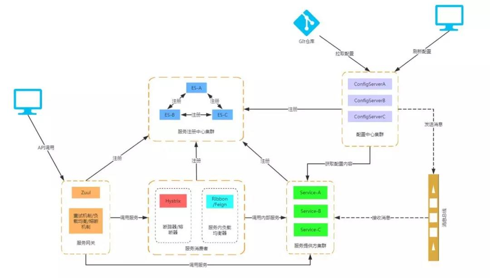
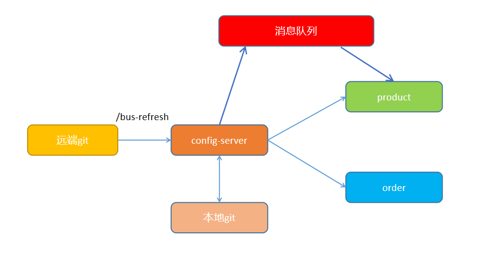
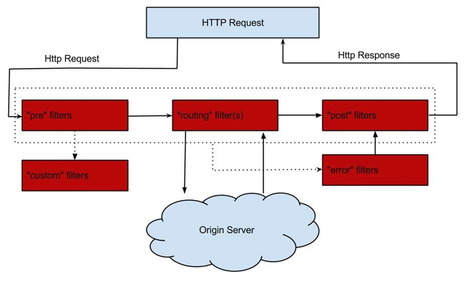

# SpringCloud

## 什么是SpringCloud

`Spring Cloud` 就是微服务系统架构的一站式解决方案，在平时我们构建微服务的过程中需要做如 **服务发现注册** 、**配置中心** 、**消息总线** 、**负载均衡** 、**断路器** 、**数据监控**等操作，而 Spring Cloud 为我们提供了一套简易的编程模型，使我们能在` SpringBoot` 的基础上轻松地实现微服务项目的构建。



## SpringCloud版本

Spring Cloud 的版本号并不是我们通常见的数字版本号，而是一些很奇怪的单词。这些单词均为英国伦敦地铁站的站名。同时根据字母表的顺序来对应版本时间顺序，比如：最早 的 Release 版本 Angel，第二个 Release 版本 Brixton（英国地名），然后是 Camden、 Dalston、Edgware、Finchley、Greenwich、Hoxton。

## SpringCloud Eureka

**服务注册 Register** ：当Client向Server注册时，它提供自身的**元数据** ，比如IP地址、端口，运行状况指示符URL，主页等。

**服务续约 Renew** ：**Client会每隔30秒(默认情况下)发送一次心跳来续约** 。 通过续约来告知Server该Client仍然存在，没有出现问题。 正常情况下，如果Server在90秒没有收到Client的续约，它会将实例从其注册表中删除。

**获取注册列表信息 Fetch Registries** ：客户端从服务器获取注册表信息，并将其缓存在本地。客户端会使用该信息查找其他服务，从而进行远程调用。该注册列表信息定期（每30秒钟）更新一次。每次返回注册列表信息可能与客户端的缓存信息不同,客户端自动处理。如果由于某种原因导致注册列表信息不能及时匹配，客户端则会重新获取整个注册表信息。服务器缓存注册列表信息，整个注册表以及每个应用程序的信息进行了压缩，压缩内容和没有压缩的内容完全相同。客户端和 服务器可以使用JSON / XML格式进行通讯。在默认的情况下客户端使用压缩 `JSON` 格式来获取注册列表的信息。

**服务下线 Cancel** ：客户端在程序关闭时向服务器发送取消请求。 发送请求后，该客户端实例信息将从服务器的实例注册表中删除。该下线请求不会自动完成，它需要调用以下内容：`DiscoveryManager.getInstance().shutdownComponent();`

**服务剔除 Eviction** ：在默认的情况下，**当Eureka客户端连续90秒(3个续约周期)没有向Eureka服务器发送服务续约，即心跳，Eureka服务器会将该服务实例从服务注册列表删除** ，即服务剔除。

### 基于Netflix Eureka做了二次封装

``` yaml
spring:
  application:
    name: eureka
server:
  port: 8761
eureka:
  instance:
    hostname: localhost
  client:
    register-with-eureka: false #是否向注册中心注册自己
    fetch-registry: false #检索注册列表
    service-url:
      defaultZone: http://${eureka.instance.hostname}:${server.port}/eureka/
  server:
    enable-self-preservation: false
```

### 两个组件组成

- Eureka Server 注册中心

```java
@EnableEurekaServer
```

- Eureka Client 服务注册

```java
@EnableEurekaClient
@EnableDiscoveryClient
```

## 通信

### RPC Dubbo

### HTTP SpringCloud

- RestTemplate

``` java
@Autowired private LoadBalancerClient client;
ServiceInstance instance = client.choose("order");
String host = instance.getHost();
String port = instance.getPort();

@Bean
@LoadBalanced
public RestTemplate restTemplate() {
   return new RestTemplate();
}
```

- Fegin

```java
@EnableFeignClients
@FeignClient
```

## Ribbon客户端负载均衡器

### 功能

- 服务发现
- 服务选择规则
- 服务监听

### 主要组件

- ServerList
- ServerListFilter
- IRule


在 `Ribbon` 中有更多的负载均衡调度算法，其默认是使用的 `RoundRobinRule` 轮询策略。

- **RoundRobinRule** ：轮询策略。`Ribbon` 默认采用的策略。若经过一轮轮询没有找到可用的 `provider`，其最多轮询 10 轮。若最终还没有找到，则返回 null。
- **RandomRule** : 随机策略，从所有可用的 provider 中随机选择一个。
- **RetryRule** : 重试策略。先按照 RoundRobinRule 策略获取 provider，若获取失败，则在指定的时限内重试。默认的时限为 500 毫秒。

还有很多，只需要知道的是默认轮询算法，并且可以更换默认的负载均衡算法，只需要在配置文件中做出修改就行。

```yaml
providerName:
  ribbon:
    NFLoadBalancerRuleClassName: com.netflix.loadbalancer.RandomRule
```

当然，在 `Ribbon` 中你还可以**自定义负载均衡算法** ，你只需要实现 `IRule` 接口，然后修改配置文件或者自定义 `Java Config` 类。

## SpringCloud Config

### 为什么需要统一配置中心

- 不方便维护
- 配置内容安全与权限
- 更新配置项目需重启

### Config Server

``` java
@EnableConfigServer
```

``` yaml
spring:
  cloud:
    server:
      git:
        uri: http://github.com/config-repo
        username: username
        password: password
        basedir: /config/basedir/ # 本地git仓库，保存配置副本
```

访问路径：

/{name}-{profiles}.yml

/{label}/{name}-{profiles}.yml

- name：服务名
- profiles：环境
- label：分支（branch）


### Config Client

使用bootstrap.yml文件替代application.yml，spring服务将先加载bootstrap.yml中的配置项。

``` yaml
spring:
  application:
    name: order
  cloud:
    config:
      discovery:
        enabled: true
        service-id: config-server
      profile: dev # 会使用远程git仓库中order-dev.yml配置
eureka:
  client:
    service-url:
      defaultZone: http://localhost:8761/eureka/
```

**order.yml和order-dev.yml同时存在的时候，访问order-dev.yml会把order.yml合并。**

### SpringCloud Bus自动刷新配置



``` xml
<dependency>
  <groupId>org.springframework.cloud</groupId>
  <artifactId>spring-cloud-starter-bus-amqp</artifactId>
</dependency>
```

``` yaml
management:
  endpoints:
    web:
      exposure:
        include: bus-refresh # 将刷新接口暴漏出来
```

**使用配置文件属性的位置需要增加`@RefreshScope`注解。** 

最后在git仓库中使用WebHooks功能，实现`/actuator/bus-refresh`接口自动调用。

## 服务网关和Zuul

### 服务网关的要素

- 稳定性，高可用
- 性能，并发行
- 安全性
- 扩展性

### 常用网关方案

- Nginx+Lua
- Tyk
- Spring Cloud Zuul
- Kong

### Zuul特点

- 路由+过滤器=Zuul
- 核心是一系列的过滤器

### Zuul的四种过滤器API

- 前置（Pre）
- 后置（Post）
- 路由（Route）
- 错误（Error）



### Zuul使用

``` java
@EnableZuulProxy
```

http://zuul-IP:PORT/target-server-name/interface

#### 自定义路由

``` yaml
management:
  security:
    enabled: false
zuul:
  routes:
    custom:
      path: /custom/**
      serviceId: order
      sensitiveHeaders: # 设置为空将不会拦截cookie等信息，默认会拦截cookie，set-cookie，authorization
  ignored-patterns: # 禁止路由的地址
    - /order/order/list
```

`/application/routes`可以查看所有路由规则。

#### Zuul使用Config动态更新配置

``` java
@Component
public class ZuulConfig {
    @ConfigurationProperties("zuul")
    @RefreshScope
    public ZuulProperties zuulProperties() {
      return new ZuulProperties();
    }
}
```

实现ZuulFilter类

#### 前置过滤器（Pre）

- 限流
- 鉴权
- 参数校验调整

#### 后置过滤器（Post）

- 统计
- 日志

#### Zuul高可用

- 多个Zuul节点注册到Eureka Server
- Nginx和Zuul混搭

## 服务容错SpringCloud Hystrix

``` xml
<dependency>
    <groupId>org.springframework.cloud</groupId>
    <artifactId>spring-cloud-starter-netflix-hystrix</artifactId>
</dependency>
```

``` java
@EnableCircuitBreaker
@SpringCloudApplication # 包含以上注解
```

### 特性

- 服务降级
- 服务熔断
- 依赖隔离
- 监控（Hystrix Dashboard）

### 服务降级

优先核心服务，非核心服务不可用或弱可用

通过HystrixCommand注解指定

fallbackMethod（回退函数）中具体实现降级逻辑

``` java
@HystrixCommand(fallbackMethod = "fallback")
@GetMapping("/list")
public String getList() {
  return restTemplate.postForObject(...);
}
private String fallback() {
  return "服务太拥挤";
}
```

Hystrix通过线程池隔离自动实现了依赖隔离。

``` yaml
hystrix:
  command:
    default: # default表示所有@Hystrix注解的方法通用配置，可自定义
      execution:
        isolation:
          thread:
            timeoutInmilliseconds: 10000
    getList: # 定义方法名，此方法使用的配置
      execution:
        isolation:
          thread:
            timeoutInmilliseconds: 10000
```

### 服务熔断

断路器分为三个状态：closed，open，half open

``` yaml
circuitBreaker:
  sleepWindowInMilliseconds: 10000 # 休眠时间窗，当断路器open，将在休眠时间后进入half open状态
  requestVolumeThreshold: 10 # 滚动时间窗口内，最小统计的请求数
  errorThresholdPercentage: 60 # 滚动时间窗口内，判定需要熔断的请求错误百分比
```

以上配置表示，在请求数达到10次时，并且有7次请求（大于60%）超时，则进入断路器open的状态，此后的所有请求直接通过fallback函数返回，当时间过去10000毫秒之后，断路器将进入half open状态，请求一次服务，如果服务正常，则恢复closed状态，如果不正常，则回到open状态。

### 监控（Hystrix Dashboard）

``` xml
<dependency>
    <groupId>org.springframework.cloud</groupId>
    <artifactId>spring-cloud-starter-netflix-hystrix-dashboard</artifactId>
</dependency>
```

``` java
@EnableHystrixDashboard
```

## 服务追踪

### 链路监控SpringCloud Sleuth

``` xml
<dependency>
    <groupId>org.springframework.cloud</groupId>
    <artifactId>spring-cloud-starter-sleuth</artifactId>
</dependency>
```

### 页面展示Zipkin

``` xml
<dependency>
    <groupId>org.springframework.cloud</groupId>
    <artifactId>spring-cloud-sleuth-zipkin</artifactId>
</dependency>
```

``` yaml
spring:
  zipkin:
    base-url: http://localhost:9411/
  sleuth:
    sampler:
      percentage: 1 # 发送外部日志百分比，默认0.1
```