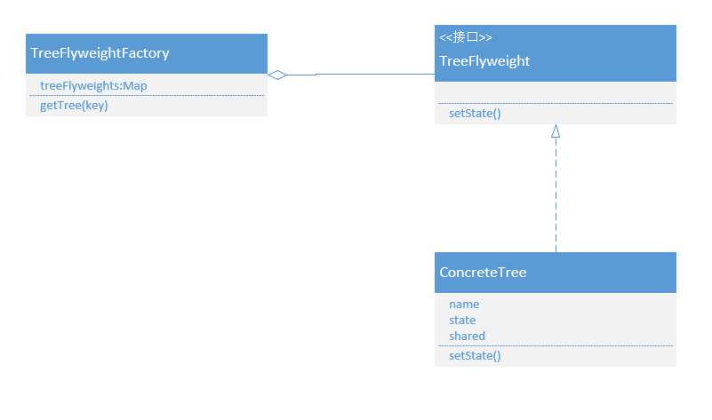

## 享元模式

### 什么是享元模式

在项目开发的过程中，我们经常会遇到各种各样的池技术，比如数据库连接池、http连接池、netty连接池、redis客户端连接池、jdk线程池等等。

连接池技术通过减少连接或线程的创建、关闭来节约资源提升性能。因为连接或线程都需要相关很多文件、连接资源、操作系统内核资源支持来完成构建，会消耗大量资源，并且创建、关闭会消耗应用程序大量性能。而连接池技术核心是连接或资源的复用。

那么连接池技术该怎么实现呢，我们拿JDBC连接池技术来说明，每个数据库连接都有一些共同的属性，比如url、driverClassName、username、password、dbname，这些属性对于每一个连接都是一样的，所以可以管理一个容器专门存放连接，初始化的时候将不变的属性作为内部数据来创建连接，使用连接的时候将变化的数据当作外部数据传入连接进行操作，用完归还连接。这样即可以提高应用程序的性能，也能减少资源不必要的浪费。

站在更高的一个维度来看这种设计思想其实就是一个设计模式：享元模式。

**享元模式运用共享技术有效地支持大量细粒度的对象。**

享元模式可以避免大量非常类似类的开销。在程序设计中，有时需要生成大量细粒度的类实例来表示数据。如果能发现这些实例出了几个参数外基本都相同，把这些参数移到类实例的外面，在方法调用时将它们传递进来，就能够通过共享大幅度减少需要实例化类的数量。

### UML类图


### UML成员

Flyweight：抽象享元类。所有具体享元类的超类或接口，通过这个接口，Flyweight可以接受并作用于外部状态。

ConcreteFlyweight：具体享元类。指定内部状态，并为内部状态增加存储空间。

UnstaredConcreteFlyweight：具体非共享享元类。指定不需共享的Flyweight子类。

FlyweightFactory：享元工厂类。用来创建并管理Flyweight对象。它主要用来确保合理的共享Flyweight，当用户请求一个Flyweight时，FlyweightFactory对象提供一个已创建的实例或创建一个（如果不存在）。

###具体场景

景观设计中经常需要许多树模型，而这些树模型除了品种，x，y坐标和年龄，其他属性都是相同的，并且景观设计中需要大量的树模型。现在编写一个实现树实例共享的程序。



抽象享元类

```java
public interface TreeFlyweight {
    void setState(TreeState state);
}
```

具体享元类

```java
public class ConcreateTree implements TreeFlyweight {
    private String name;
    private TreeState state;
    private String shared;
    public ConcreateTree(String name, String shared) {
        this.name = name;
        this.shared = shared;
        System.out.println("生成一棵" + name);
    }
    @Override
    public void setState(TreeState state) {
        this.state = state;
    }
    @Override
    public String toString() {
        return "ConcreateTree{" +
                "name='" + name + '\'' +
                ", state=" + state +
                ", shared='" + shared + '\'' +
                '}';
    }
}
```

享元工厂类

```java
public class TreeFlyweightFactory {
    private static Map<String, TreeFlyweight> map = new HashMap<> ();
    public static TreeFlyweight getTree(String name, TreeState state) {
        TreeFlyweight treeFlyweight = map.get (name);
        if (treeFlyweight == null) {
            treeFlyweight = new ConcreateTree (name, "树共享属性");
            map.put (name, treeFlyweight);
            treeFlyweight.setState (state);
        }
        return treeFlyweight;
    }
}
```

### 优点

- 减少运行时对象实例的个数，节省内存
- 将许多“虚拟”对象的状态集中管理

### 缺点

- 一旦实现了享元模式，那么单个的逻辑实例将无法拥有独立而不同的行为

