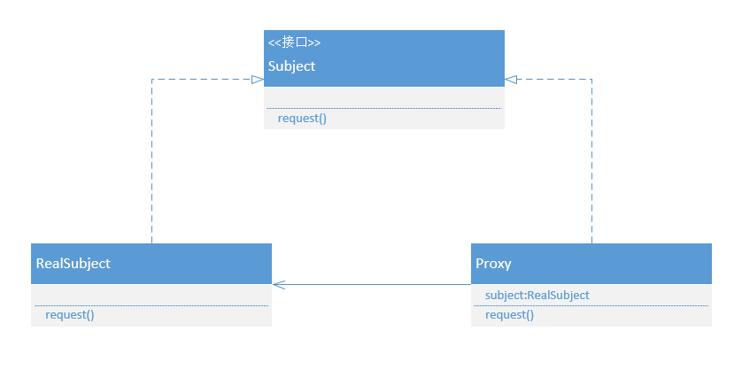

## 代理模式

### 什么是代理模式

生活中经常遇到需要第三方介入的情景，比如：网上购物需要购物平台这样的第三方；给姑娘写情书需要她的朋友帮忙传递等等。这个第三方在软件设计里面有一个专门的名字叫做代理模式。

**代理模式为另一个对象提供一个替身或占位符以控制对这个对象的访问。**

那么为什么需要一个代理对象来对实例进行代理控制呢？网络购物找到第三方做代理是因为网络商品看得见摸不到，质量得不到控制，所以需要第三方平台来做一个中介监管买方和卖方的一些行为。找朋友帮忙送信是因为不认识收信人或者收信人不会直接收取写信人的信件，所以找一个代理人提高送信成功的机率。从两个例子可以感受到，代理对象可以控制对某对象的访问。

**使用代理模式创建代表对象，让代表对象控制某对象的访问。**

代理控制访问的方式：

- 远程代理控制访问远程对象
- 虚拟代理控制访问创建开销大的对象
- 保护代理基于权限控制对资源的访问

### UML类图



### UML成员

Subject：抽象主体。声明了真实主体和代理对象的共同接口，允许任何客户端像处理RealSubject对象一样处理Proxy对象。

RealSubject：具体主体。RealSubject通常是真实做事的对象，Proxy对象会控制对RealSubject的访问。

Proxy：代理对象。Proxy持有Subject引用，必要时将请求转发给Subject。

### 具体场景

网上商店上架了一批高端产品，老板想让会员用户看到会员价，而非会员用户看到原价。


抽象商品：

```java
public interface Product {
    double show();
}
```

真实商品：

```java
public class RealProduct implements Product {
    private double price;
    public RealProduct(double price) {
        this.price = price;
    }
    @Override
    public double show() {
        return price;
    }
}
```

代理对象：

```java
public class ProxyProduct implements Product {
    private Product product;
    private String grade;
    public ProxyProduct(Product product, String grade) {
        this.product = product;
        this.grade = grade;
    }
    @Override
    public double show() {
        double price = product.show ();
        switch (grade) {
            case "member":
                price = price*0.8;
                break;
            default:
                break;
        }
        return price;
    }
}
```

客户端：

```java
public class Client {
    public static void main(String args[]) {
        Product realProduct = new RealProduct (100.0d);
        Product proxyProduct = new ProxyProduct (realProduct, "member");
        double price = proxyProduct.show ();
        System.out.println("商品价格为：" + price);
    }
}
```

### 优点

- 职责清晰。真实主体只需要实现实际的业务逻辑，不用关系非本职责的控制，代码清晰简洁，在一定程度上降低耦合度。
- 代理对象在客户端和目标对象之间起到了中介作用，可以在一定程度上保护目标对象。
- 高扩展性。

### 缺点

- 在客户端和目标对象之间增加了代理对象，增加了系统的复杂性。

### JDK动态代理

Java在java.lang.reflect包中有自己的代理支持，利用这个包可以在运行时动态的创建一个代理类，实现一个或多个接口，并将方法的调用转发到指定的类。因为实际的代理类是在运行时创建的，所以称这个Java技术为动态代理。


需要实现InvacationHandler接口，Proxy上的任何方法调用都会被传入此类。InvocationHandler控制对RealSubject方法的访问。Proxy是由Java产生的，而且实现了完整的Subject接口。

InvocationHandler实现类

```java
public class MemberInvocationHandler implements InvocationHandler {
    private Product product;
    private String grade;
    public MemberInvocationHandler(Product product, String grade) {
        this.product = product;
        this.grade = grade;
    }
    @Override
    public Object invoke(Object proxy, Method method, Object[] args) throws Throwable {
        if ("member".equals (grade))
            return ((double) method.invoke (product, args)) * 0.8;
        else
            return method.invoke (product, args);
    }
}
```

客户端

```java
public class Client {
    public static void main(String args[]) {
        Product product = new RealProduct (100.0d);
        Product proxy = (Product) Proxy.newProxyInstance (Client.class.getClassLoader (),
                new Class[]{Product.class},
                new MemberInvocationHandler (product, "member"));
        double price = proxy.show ();
        System.out.println("商品价格为：" + price);
    }
}
```

JDK动态代理其实在底层利用反射为每个需要代理的对象都创建了一个InvocationHandler实例，在调用目标对象时，其首先会调用代理对象，然后在代理对象的逻辑中请求目标对象。

JDK动态代理解决了静态代理需要为每个业务接口创建一个代理类的问题，虽然使用反射创建代理对象效率比静态代理稍低，但在现代高速JVM中也是可以接受的，在Spring的AOP代理中默认就是使用的JDK代理实现的。

JDK动态代理的限制也是比较明显的，即其需要被代理的对象必须实现一个接口。如果被代理对象没有实现任何接口或者被代理对象的业务方法没有相应的接口，则不能使用JDK动态代理。