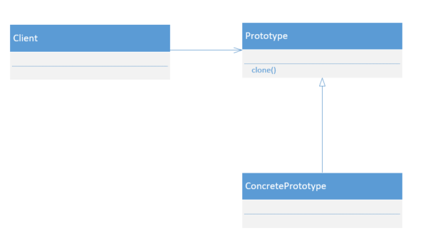
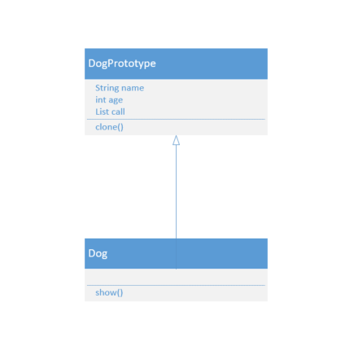

## 原型模式

### 什么是原型模式

**原型模式：当创建给定类的实例的过程很昂贵或很复杂时，就使用原型模式。**

原型模式是一种创建型模式，允许用户从一个样板实例中复制出一个内部属性一致的对象，俗称克隆。被复制的实例称为原型。原型模式多用在比较复杂或耗时的情况下，因为复制一个已经存在的实例可以时程序运行更高效。

原型类需要具备两个前提条件：

- 实现Cloneable接口。在Java语言中，Cloneable接口只有一个作用，就是运行时通知虚拟机可以安全的在实现了此接口的类上使用clone方法。在Java虚拟机中，只有实现了这个接口的类才能被拷贝，否则会抛出CloneNotSupportedException异常。
- 重写Object类中的clone方法。Object类中的clone方法，作用时返回对象的一个拷贝，其作用域是protected，一般类无法调用，因此，需要重写clone方法为public修饰符的。

使用原型模式的注意事项：

- 使用原型模式复制对象不会调用构造方法。对象的复制是通过调用Object类的clone方法完成的，它直接在内存中复制数据，因此不会调用到类的构造方法。不但构造方法中的代码不会执行，甚至连访问权限都对原型模式无效。单例模式中，只要将构造方法的访问权限设置为private，就可以实现单例。但是clone方法无视构造方法的权限，所以，单例模式和原型模式是冲突的。
- Object类的clone方法只会拷贝对象中的基本数据类型，对于数组、容器对象、引用对象等都不会拷贝，这就是浅拷贝。如果需要实现深拷贝，必须将原型模式中的数组、容器对象、引用对象等另行拷贝。

### UML类图



### UML成员

Prototype：抽象原型类。声明克隆的能力

ConcretePrototype：具体原型类

Client：客户端

### 具体场景

科学模拟游戏中一个科学家研究出克隆技术，需要对小狗做实验，现用代码实现小狗的克隆结果。



原型狗类：

```java
public abstract class DogPrototype implements Cloneable {
    public String name;
    public int age;
    public ArrayList<String> call = new ArrayList<> ();

    @Override
    public Object clone() throws CloneNotSupportedException {
        DogPrototype dog = (DogPrototype) super.clone ();
        dog.call = (ArrayList<String>) this.call.clone();
        return dog;
    }

    public abstract void show();
}
```

具体可被克隆的狗类：

```java
public class Dog extends DogPrototype {
    @Override
    public void show() {
        System.out.println(this.toString ());
        System.out.println("name is " + this.name + "\n" +
                            "age is " + this.age + "\n" +
                            "call is " + this.call);
    }
}
```

客户端：

```java
public class Client {
    public static void main(String args[]) throws CloneNotSupportedException {
        Dog dog = new Dog ();
        dog.name = "tom";
        dog.age = 1;
        dog.call.add ("wangwang");
        dog.call.add ("wuwu");
        Dog dog1 = (Dog) dog.clone ();
        dog.show ();
        dog1.show ();
        System.out.println(dog == dog1);
    }
}
```

运行结果：

```java
prototype.Dog@4554617c
name is tom
age is 1
call is [wangwang, wuwu]
prototype.Dog@74a14482
name is tom
age is 1
call is [wangwang, wuwu]
false
```

### 优点

- 向客户隐藏制造新实例的复杂性
- 提供让客户能够产生未知类型对象的选项
- 在某些环境下，复制对象比创建对象更有效

### 缺点

- 对象的复制有时先当复杂
- 逃避了构造函数的约束