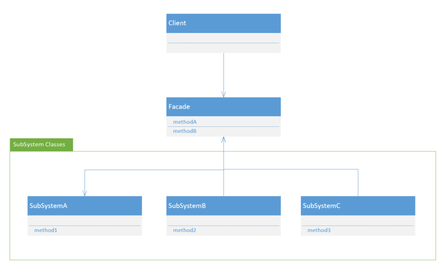
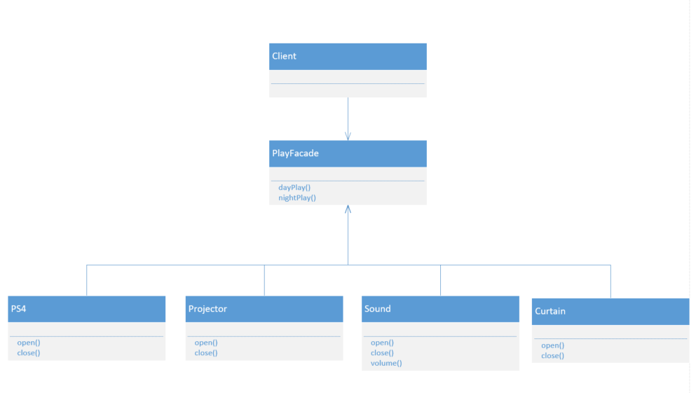

## 外观模式

### 什么是外观模式

对于很多程序员来说，每天早上到办公室都有一个很繁琐很无聊的工作要做，那就是打开各种电脑软件：编程工具、通讯工具、邮箱、各种文档...这些事情没难度，但是却浪费我们的时间和经历。那我们可不可以像一个办法，一键打开所有需要用到的软件，下班的时候一键关闭呢？这个情形想起了外观模式，也可以叫做门面模式。

**外观模式提供了一个统一的接口，用来访问子系统中的一群接口。外观定义了一个高层接口，让子系统更容易使用。**

所以我们可以将所有软件的启动脚本封装进一个脚本里，只需要执行一个脚本就可以打开所有需要的软件。接下来就可以打杯热水，美美的想想一天的工作计划开始写代码了。

其实在我们日常生活中可以发现很多应用到外观模式的地方。比如，我们很多人把每个月攒下的工资用于理财，但是直接投入股市心里又没底，毕竟股票市场千变万化，需要的专业知识众多繁杂。这时候专业的人士设计了一套方案，将股票市场繁琐复杂的系统封装起来，对外提供一个简单的接口，只要大家投资这个接口，剩下的就交给专业人士投资。这种投资手段叫基金。基金使用的模式就是外观模式。

使用外观模式，需要创建一个接口简化而且统一的类，用来包装子系统中一个或多个复杂的类。外观模式相当直接，很容易理解，但这不会降低它的威力：外观模式允许我们让客户和子系统之间避免紧耦合，而且遵循一种**设计原则——最少知道原则。**

其实最少知道原则提供了一些方针——就任何对象而言，在该对象的方法内，我们只应该调用的范畴：

- 该对象本身
- 被当作方法的参数而传递进来的对象
- 此方法所创建或实例化的对象
- 对象的任何组件

### UML类图



### UML成员

SubSystem：各种复杂的子系统。

Facade：外观类。封装复杂子系统的方法，提供简单易懂的接口。

Client：客户端。

### 具体场景

给书房装了一套智能设备，设计一个遥控器，分为白天游戏和夜晚游戏两种模式，白天游戏模式过程：关闭窗帘、打开游戏机、投影仪投射游戏画面、调节音响声音到60%。夜晚游戏模式过程：打开游戏机、投影仪投射游戏画面、调节音响声音到30%。



四种智能设备：

```java
public class PS4 {
    public void openPS4() {
        System.out.println("打开PS4...");
    }
    public void closePS4() {
        System.out.println("关闭PS4...");
    }
}
```

```java
public class Projector {
    public void openProjector() {
        System.out.println("打开投影仪，将游戏画面投射到屏幕...");
    }
    public void closeProjector() {
        System.out.println("关闭投影仪...");
    }
}
```

```java
public class Sound {
    public void openSound() {
        System.out.println("打开音响...");
    }
    public void closeSound() {
        System.out.println("关闭音响...");
    }
    public void volume(int size) {
        System.out.println("设置音响音量到" + size + "%");
    }
}

```

```java
public class Curtain {
    public void openCurtain() {
        System.out.println("打开窗帘...");
    }
    public void closeCurtain() {
        System.out.println("关闭窗帘...");
    }
}
```

外观类：

```java
public class PlayFacade {
    private PS4 ps4;
    private Projector projector;
    private Sound sound;
    private Curtain curtain
    public PlayFacade(PS4 ps4, Projector projector,
                      Sound sound, Curtain curtain) {
        this.ps4 = ps4;
        this.projector = projector;
        this.sound = sound;
        this.curtain = curtain;
    }
    public void dayPlay() {
        ps4.openPS4 ();
        projector.openProjector ();
        sound.openSound ();
        sound.volume (60);
        curtain.closeCurtain ();
    }
    public void nightPlay() {
        ps4.openPS4 ();
        projector.openProjector ();
        sound.openSound ();
        sound.volume (30);
    }
    public void close() {
        curtain.closeCurtain ();
        sound.closeSound ();
        projector.closeProjector ();
        ps4.closePS4 ();
    }
}
```

客户端：

```java
public class Client {
    public static void main(String args[]) {
        PS4 ps4 = new PS4 ();
        Projector projector = new Projector ();
        Sound sound = new Sound ();
        Curtain curtain = new Curtain ();
        PlayFacade playFacade = new PlayFacade (ps4, projector, sound, curtain);
        playFacade.dayPlay ();
        playFacade.close ();
    }
}
```

### 优点

- 引入外观模式，使客户端对子系统的使用变得简单了。
- 减少了与子系统的关联关系，实现了子系统于客户端间的松耦合。
- 提供了一个客户端访问子系统的简单入口，但并不影响直接使用子系统。

### 缺点

- 不引入抽象外观类的情况下，新增子系统可能需要修改外观类，违反开-闭原则。
- 不能很好的限制客户端调用子系统。