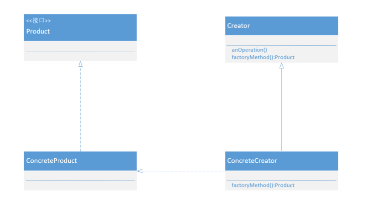
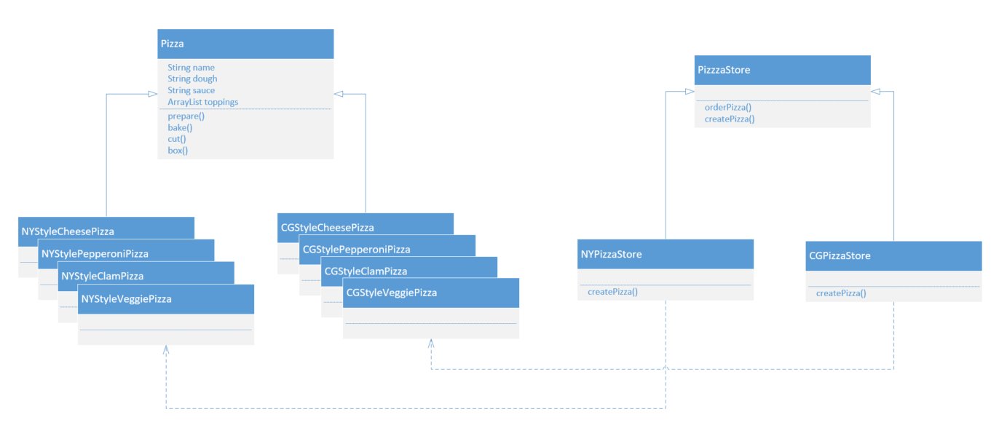

## 工厂方法模式

### 什么是工厂方法模式

**设计原则中有一句话：类应该对扩展开放，对修改关闭。**对于简单工厂，是将创建产品的细节抽取封装到一个工厂类中，如果在后来的扩展中又加入了新的产品，就需要对工厂类创建产品的方法进行修改，这样就违背了开-闭原则。

那么怎样设计工厂类才能使每次新增加的产品不会违背开闭原则，并且可以灵活的对系统进行扩展呢？我们需要解决以下几个问题：

- 只能对现有的工厂类进行扩展，不能修改已有工厂类创建实例的逻辑
- 每次有新产品只需要对创建细节进行定义扩展

为了解决以上的问题，可以定义一个抽象类，提供创建对象方法的接口，但由子类实现创建方法，决定要实例化的类是哪一个。在抽象类中，任何其他实现的方法都可以使用到这个创建接口所制造出来的产品，但只有子类真正实现这个工厂方法并创建产品。这种设计模式称为工厂方法模式。

**工厂方法模式：定义了一个创建对象的接口，但由子类决定要实例化的类是哪一个。工厂方法让类把实例化推迟到子类。**

工厂方法模式是简单工厂的延伸。在工厂方模式中，核心工厂类不在负责产品的创建，而是将具体的创建工作交给子类完成。当系统需要增加其他新的对象时，只需要添加一个具体的产品和它的创建工厂即可，不需要对原工厂进行任何修改，很好的符合了开-闭原则。

### UML类图



### UML成员

Product：抽象产品。所有产品实现共同接口，这样一来，使用这些产品的类可以应用接口，而不是具体类。

ConcreteProduct：具体产品。

Creator：抽象创建者工厂。实现了所有操纵产品的方法，但不实现工厂方法。

ConcreteCreator：具体创建者工厂。实现工厂方法，负责创建一个或多个具体产品，只有ConcreteCreator类知道如何创建产品。

### 具体场景

一个品牌披萨有很多加盟店，他们许多并不像依照总店的制作流程生成披萨，而是希望采用自己的制作流程。



抽象披萨：

```java
public abstract class Pizza {
    String name;
    String dough;
    String sauce;
    List<String> toppings = new ArrayList<>();
    public void prepare() {
        System.out.println("Preparing " + name);
        System.out.println("Tossing docgh " + dough);
        System.out.println("Adding sauce " + sauce);
        System.out.println("Adding toppings: ");
        for (String top : toppings) {
            System.out.println(" " + top);
        }
    }
    public void bake() {
        System.out.println("Bake for 25 minutes at 350");
    }
    public void cut() {
        System.out.println("Cutting the pizza into diagonal sliices");
    }
    public void box() {
        System.out.println("Place pizza in official PizzaStore box");
    }
}
```

具体披萨：

```java
public class NYStyleCheesePizza extends Pizza {
    public NYStyleCheesePizza() {
        name = "NY Style Cheese Pizza";
        dough = "Thin Crust Dough";
        sauce = "Marinara Sauce";
        toppings.add("Grated Reggiano Cheese");
    }
}
```

抽象工厂：

```java
public abstract class PizzaStore {
    public Pizza orderPizza(String type) {
        Pizza pizza = createPizza (type);
        pizza.prepare ();
        pizza.bake ();
        pizza.cut ();
        pizza.box ();
        return pizza;
    }
    protected abstract Pizza createPizza(String type);
}
```

具体工厂：

```java
public class NYPizzaStore extends PizzaStore {
    @Override
    protected Pizza createPizza(String type) {
        Pizza pizza = null;
        switch (type) {
            case "cheese":
                pizza = new NYStyleCheesePizza ();
                break;
            case "veggie":
                pizza = new NYStyleVeggiePizza ();
                break;
            case "clam":
                pizza = new NYStyleClamPizza ();
                break;
            case "pepperoni":
                pizza = new NYStylePepperoniPizza ();
                break;
            default:
                break;
        }
        return pizza;
    }
}
```

### 优点

在工厂方法中，客户端只需要知道所要产品的具体工厂，无需关心具体的创建过程，甚至不需要具体产品的类名。

增加新的产品时，只需要添加一个具体产品类和对应的实现工厂，无需对原工厂进行任何修改，符合开-闭原则。

### 缺点

每增加一个产品时，都需要增加一个具体类和实现工厂，导致系统中类的个数成倍增加，在一定程度上增加了系统的复杂度，同时也增加了系统具体类的依赖 。