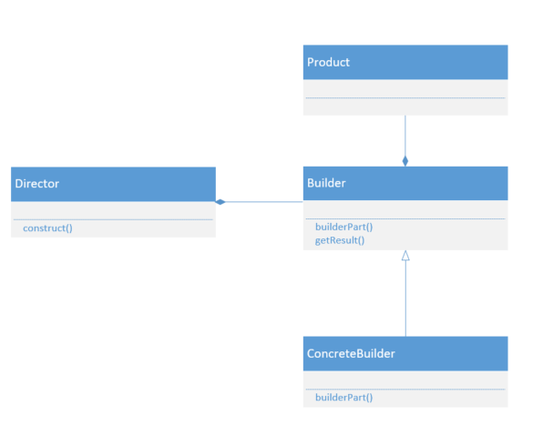
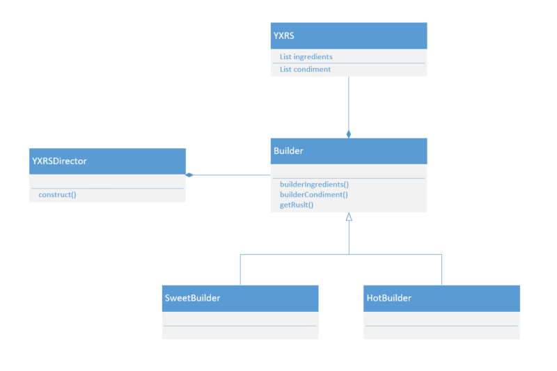

## 建造者模式

### 什么是建造者模式

很多人都喜欢吃麦当劳，肯德基这样的西式快餐，不单是因为方便快捷，而且不同的店做出来的味道基本差不多，满足自己的口味。但是不同的店铺，不同的厨师，做出来的食物口味相差不多，是不是有点神奇。其实明白了其中的原理，实现这样的效果还是挺简单的。要想满足食物的味道在不同人的操作下相差不大，只要对每种食物制定一套规范的工作流程，原料放多少，加热几分钟，放多少调料...不同的人按照这个流程制作，做出来的食物口味上就大同小异了。而顾客点餐的时候，只需要把顾客想要的菜单给后厨，后厨就能按照这么一套流程做出相应的食物提供给顾客，并且使顾客完全感受不到这套流程的存在。

其实上述的模式，就是建造者模式。**建造者模式将一个复杂对象的构建与它的表示分离，使得同样的构建过程可以创建不同的表示。**

建造者模式可以将一个产品的内部表象与产品的生成过程分割开来，从而可以是一个建造过程生成具有不同的内部表象的产品对象。如果我们使用建造者模式，那么用户就只需指定需要建造的类型就可以得到它们， 而具体建造的过程和细节就不需要知道了。

**通常我们用建造者模式创建一些复杂的对象，这些对象内部构建间的建造顺序通常是稳定的，但对象内部的构建通常面临着复杂的变化。建造者模式的好处就是使得建造代码与表示代码分离，由于建造者隐藏了该产品是如何组装的，所以若需要改变一个产品的内部表示，只需要再定义一个具体的建造者就可以了。**

### UML类图



### UML成员

Builder：抽象建造者。声明为创建一个产品对象的各个部件指定的抽象接口。

ConcreteBuilder：具体建造者。

Director：指挥者。构建一个使用Builder接口的对象，用于创建一个复杂的对象，它主要有两个作用，一是隔离了对象的生产过程，二是负责控制产品对象的生产过程。

Product：产品角色。

### 具体场景

过年了，本市最有名气的饭店为了应对节中火爆的客流量和不同的口味，为鱼香肉丝定制了两套流程，一种是偏甜的，一种是偏辣的。



产品类：

```java
public class YXRS {
    private List<String> ingredients = new ArrayList<> ();
    private List<String> condiment = new ArrayList<> ();
    public List<String> getIngredients() {
        return ingredients;
    }
    public void setIngredients(String ingredient) {
        this.ingredients.add (ingredient);
    }
    public List<String> getCondiment() {
        return condiment;
    }
    public void setCondiment(String condiment) {
        this.condiment.add (condiment);
    }
    @Override
    public String toString() {
        return "YXRS{" +
                "ingredients=" + ingredients +
                ", condiment=" + condiment +
                '}';
    }
}
```

抽象建造者：

```java
public abstract class Builder {
    protected YXRS yxrs = new YXRS ();
    public abstract void builderIngredients();
    public abstract void builderCondiment();
    public YXRS getResult() {
        return yxrs;
    }
}
```

具体建造者：

```java
public class SweetBuilder extends Builder {
    @Override
    public void builderIngredients() {
        yxrs.setIngredients ("胡萝卜");
        yxrs.setIngredients ("青椒");
        yxrs.setIngredients ("肉丝");
    }
    @Override
    public void builderCondiment() {
        yxrs.setCondiment ("盐");
        yxrs.setCondiment ("酱油");
        yxrs.setCondiment ("糖");
    }
}
```

指挥者：

```java
public class YXRSDirector {
    private Builder builder;
    public YXRSDirector(Builder builder) {
        this.builder = builder;
    }
    public YXRS construct() {
        builder.builderIngredients ();
        builder.builderCondiment ();
        return builder.getResult ();
    }
}
```

### 优点

- 将一个复杂对象的创建过程封装起来
- 允许对象通过多个步骤来创建，并且可以改变过程（这和只有一个步骤的工厂模式不同）
- 向客户隐藏产品内部的表现
- 产品的实现可以替换，因为客户只看到一个抽象的接口

###缺点

- 建造者模式所创建的产品一般具有较多的共同点，其组成部分相似，如果产品之间的差异性很大，则不适合使用建造者模式，因此其使用范围收到一定的限制
- 如果产品内部变化复杂，可能会导致需要定义很多具体建造者类来实现这种变化，导致系统变得庞大