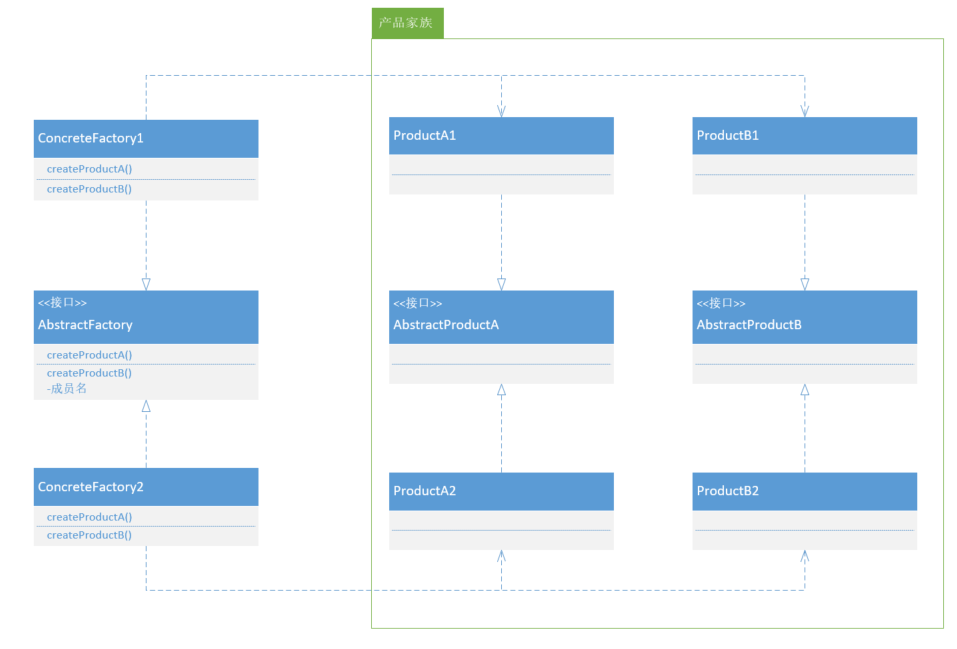
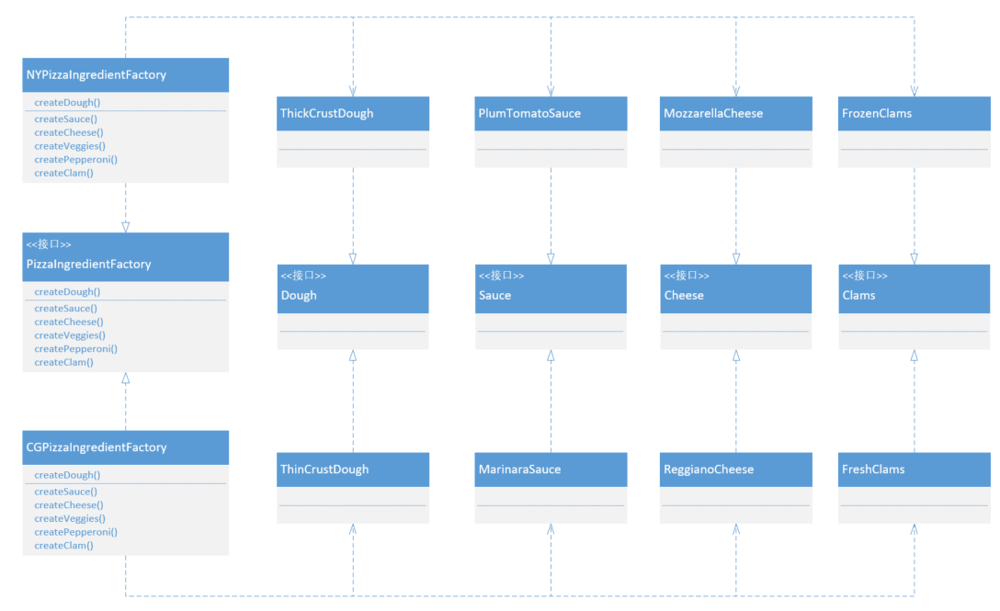

## 抽象工厂模式

###什么是抽象工厂模式

在工厂方法模式中，使用一个工厂创建一个产品。但是有时候我们需要一个工厂能够提供一系列的产品对象，而不是单一的。这时候可以将工厂方法模式扩展一下，以前工厂方法抽象创建者工厂提供一个抽象方法，继承抽象创建者的具体创建者工厂继承该抽象方法，实现具体的创建细节，获取单一的产品实例。如果抽象创建者工厂提供多个抽象方法，那么继承该接口的具体创建者工厂可以实现多个产品的创建。这个模式被称为抽象工厂模式。

**抽象工厂模式提供一个接口，用于创建相关或依赖对象的家族，而不需要明确指定具体类。**

产品家族：指的是属于同一品牌或工厂下的，作用于不同用途的相关产品。比如，操作数据库抽象出来的不同对象，参数对象，字段对象，语句对象等等，他们应该属于同一产品家族。

抽象工厂允许客户端使用抽象的接口来创建一组相关产品，而不需要知道（或关心）实际产出的具体产品是什么。这样一来，客户端就从具体的产品中被解耦。

### UML类图



### UML成员

AbstractFactory：抽象工厂。定义了一个接口，所有具体工厂都必须实现此接口，这个接口包含一组方法用来生产产品。

ConcreteFactory：具体工厂。实现不同的产品家族。要创建一个产品，客户端只需要使用其中一个工厂而完全不需实例化任何产品对象。

AbstractProduct：抽象产品。

Product：具体产品。

### 具体场景

建造一家生产披萨原料的工厂，并将原料运送到不同的加盟店。加盟店位于不同的区域，使用的原料也不相同。所以对于纽约和芝加哥，准备了两组不同的原料。



抽象工厂：

```java
public interface PizzaIngredientFactory {
    Dough createDough();
    Sauce createSauce();
    Cheese createCheese();
    Clams createClams();
}
```

具体工厂：

```java
public class NYPizzaIngredientFactory implements PizzaIngredientFactory {
    @Override
    public Dough createDough() {
        return new ThinCrustDough ();
    }
    @Override
    public Sauce createSauce() {
        return new MarinaraSauce ();
    }
    @Override
    public Cheese createCheese() {
        return new ReggianoCheese ();
    }
    @Override
    public Clams createClams() {
        return new FreshClams ();
    }
}
```

抽象披萨：

```java
public abstract class Pizza {
    protected String name;
    protected Dough dough;
    protected Sauce sauce;
    protected Cheese cheese;
    protected Clams clams;
    public abstract void prepare();
    public void bake() {
        System.out.println("Bake for 25 minutes at 350");
    }
    public void cut() {
        System.out.println("Cutting the pizza into diagonal slices");
    }
    public void box() {
        System.out.println("Place pizza in official PizzaStore box");
    }
    public void setName(String name) {
        this.name = name;
    }
    public String getName() {
        return name;
    }
    @Override
    public String toString() {
        return "This pizza is " + getName () + "\n" +
                "Dough is " + dough + "\n" +
                "Sauce is " + sauce + "\n" +
                "Cheese is " + cheese + "\n" +
                "Clams is " + clams + "\n" +
```

具体披萨：

```java
public class CheesePizza extends Pizza {
    PizzaIngredientFactory factory;
    public CheesePizza (PizzaIngredientFactory factory) {
        this.factory = factory;
    }
    @Override
    public void prepare() {
        System.out.println("Preparing " + name);
        dough = factory.createDough ();
        sauce = factory.createSauce ();
        cheese = factory.createCheese ();
    }
}
```

抽象商店：

```java
public abstract class PizzaStore {
    public Pizza orderPizza(String type) {
        Pizza pizza = createPizza (type);
        pizza.prepare ();
        pizza.bake ();
        pizza.cut ();
        pizza.box ();
        return pizza;
    }
    protected abstract Pizza createPizza(String type);
}
```

具体商店：

```java
public class NYPizzaStore extends PizzaStore {
    @Override
    protected Pizza createPizza(String type) {
        Pizza pizza = null;
        PizzaIngredientFactory factory = new NYPizzaIngredientFactory ();
        switch (type) {
            case "cheese":
                pizza = new CheesePizza (factory);
                pizza.setName ("New York Style Cheese Pizza");
                break;
            case "veggie":
                pizza = new VeggiePizza (factory);
                pizza.setName ("New York Style Veggie Pizza");
                break;
            case "clam":
                pizza = new ClamPizza (factory);
                pizza.setName ("New York Style Clam Pizza");
                break;
            case "pepperoni":
                pizza = new PepperoniPizza (factory);
                pizza.setName ("New York Style Pepperoni Pizza");
                break;
        }
        return pizza;
    }
}
```

### 优点

抽象工厂模式隔离了具体类的生成，使客户端不需要知道什么被创建。所有的具体工厂都实现了抽象工厂中定义的公共接口，因此只需要改变具体工厂的实例，就可以在某种程度上改变整个软件系统的行为。

当一个产品家族中的多个对象被设计成一起工作时，抽象工厂能保证客户端始终只使用同一个产品家族中的对象。

### 缺点

添加新的行为时比较麻烦，如果需要添加一个新产品家族对象时，需要改变接口及其下所有子类，必然会带来很大的麻烦。