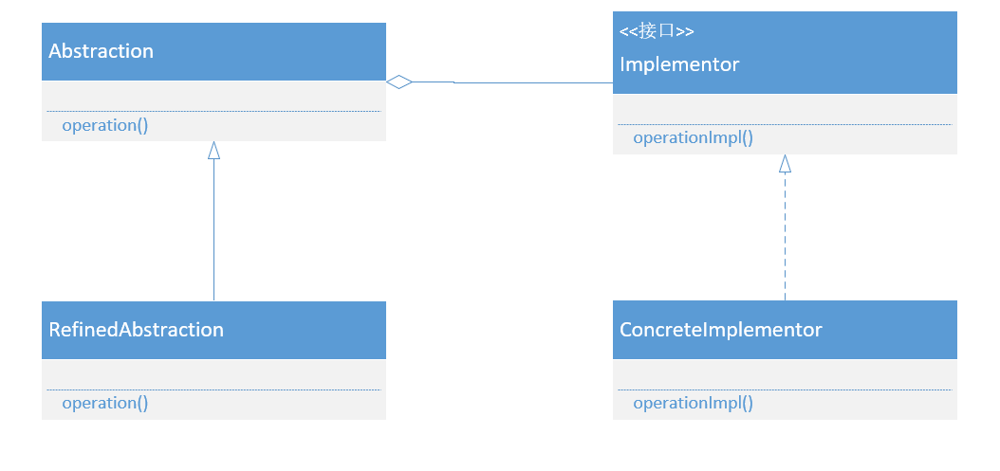
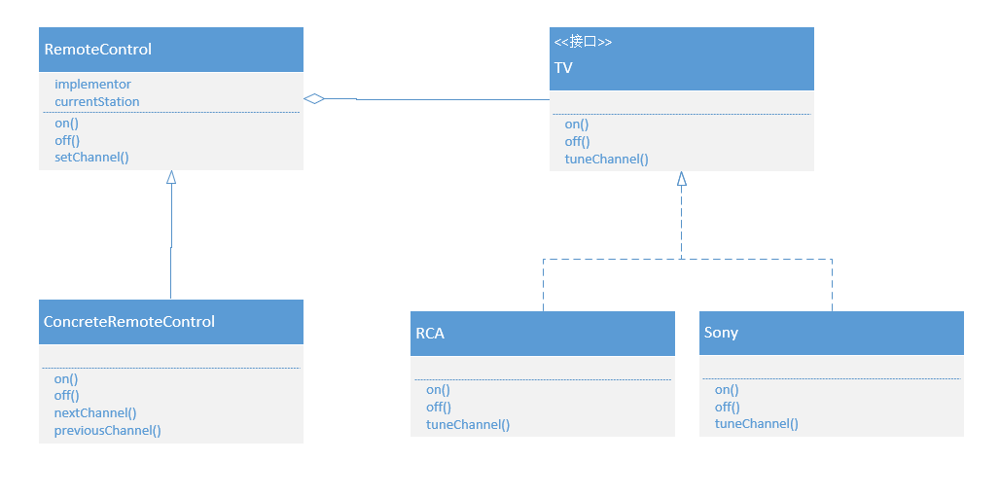

## 桥接模式

### 什么是桥接模式

面向对象的三大基本特征是封装、继承和多态。在刚刚接触到继承的时候感觉它即新颖又强大，所以只要可以用，就都用上继承。

但事实上，很多情况用继承会带来很多麻烦。比如，对象的继承关系在编译时期就定义好了，所以无法在运行时改变从父类继承的实现。**子类的实现与它的父类有非常紧密的依赖关系，以至于父类实现中的任何变化必然会导致子类发生变化。**当你需要复用子类的时候，如果继承下来的实现不适合解决新的问题，则父类必须重写或被其他更合适的类替换。这种依赖关系限制了灵活性并最终限制了复用性。简单来说，**继承耦合性太高强**。

所以，面向对象设计中，应该优先考虑**组合/聚合复用原则：多用组合/聚合，少用继承**。

聚合表示一种弱的‘拥有’关系，体现的是A对象可以包含B对象，但B对象不是A对象的一部分，比如大雁和雁群的聚合关系；组合表示一种强的‘拥有’关系，体现了严格的部分和整体的关系，部分和整体的生命周期一致，比如大雁和翅膀的关系。

**组合/聚合复用原则的好处是，优先使用对象的组合/聚合将有助于你保持每个类被封装，并被集中在单个任务上。这样类和类继承层次会保持较小规模，并且不太可能增长为不可控制的庞然大物。**

有一种设计模式就正式运用了组合/聚合复用原则来定义实现的，就是**桥接模式：将抽象部分与它的实现部分分离，使它们都可以独立的变化。**

将抽象部分与它的实现部分分离，并不是说让抽象类和它的派生类分离，这没有任何意义，实现指的是抽象类和它的派生类用来实现自己的对象。通俗一些就是实现系统可能有多维度分类，每一种分类都有可能变化，那么就把这种多角度分离出来让它们独立变化，减少它们之间的耦合。

桥接模式还符合开放-封闭原则。

### UML类图



### UML成员

Abstraction：抽象化角色。抽象化给出的定义，并保存一个实现化对象的引用。抽象化角色应当只给出基于底层操作的更高一层的操作。

RefindAbstraction：具体抽象化角色。扩展抽象化角色，改变或修正父类对抽象化的定义。

Implementor：实现化角色。定义实现化角色的接口。实现化角色应当只给出底层操作。

ConcreteImplementor：具体实现化角色。实现化角色的具体实现。

### 具体场景

设计一个遥控器模块，每部不同型号的电视都有自己的遥控器实现。



抽象化角色：

```java
public abstract class RemoteControl {
    protected TV tv;
    protected int currentStation;
    public RemoteControl(TV tv) {
        this.tv = tv;
    }
    public abstract void on();
    public abstract void off();
    public void setChannel(int channel) {
        tv.tuneChannel (channel);
        currentStation = channel;
    }
}
```

扩展抽象化角色：

```java
public class ConcreteRemoteControl extends RemoteControl {
    public ConcreteRemoteControl(TV tv) {
        super (tv);
        currentStation = 1;
    }
    @Override
    public void on() {
        tv.on ();
    }
    @Override
    public void off() {
        tv.off ();
    }
    public void nextChannel() {
        currentStation ++;
        tv.tuneChannel (currentStation);
    }
    public void previousChannel() {
        currentStation --;
        tv.tuneChannel (currentStation);
    }
}
```

实现化角色：

```java
public interface TV {
    void on();
    void off();
    void tuneChannel(int channel);
}
```

具体的实现化角色：

```java
public class Sony implements TV {
    @Override
    public void on() {
        System.out.println("Sony on");
    }
    @Override
    public void off() {
        System.out.println("Sony off");
    }
    @Override
    public void tuneChannel(int channel) {
        System.out.println("Channel is " + channel);
    }
}

public class RCA implements TV {
    @Override
    public void on() {
        System.out.println("RCA on");
    }
    @Override
    public void off() {
        System.out.println("RCA off");
    }
    @Override
    public void tuneChannel(int channel) {
        System.out.println("Channel is " + channel);
    }
}
```

### 优点

- 将实现予以解耦，分离抽象接口和实现部分，提供了比继承更好的解决方案
- 抽象和实现可以独立扩展，不会影响到对方
- 实现细节对客户透明，可以对用户隐藏实现细节

### 缺点

- 增加了系统的复杂性
- 使用桥接模式需要正确识别出独立变化的维度，使用范围有一定的局限性