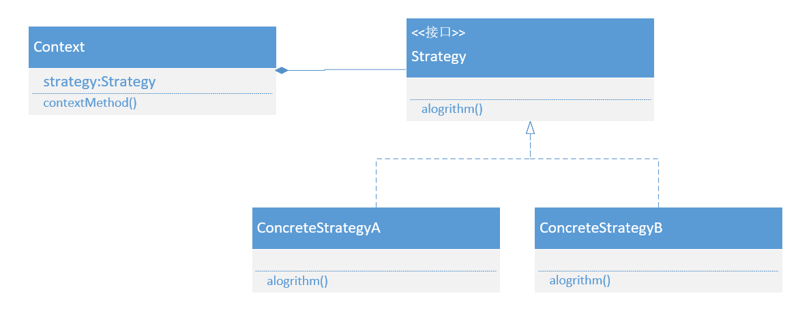
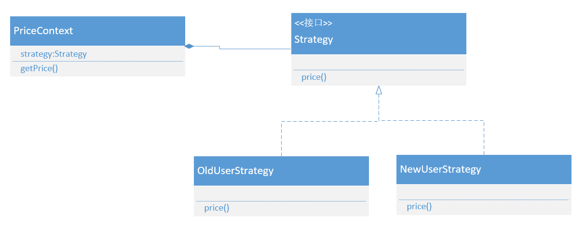

## 策略模式

### 什么是策略模式

在虚拟的网络世界中，购物网站往往根据不同的用户制定不同的报价策略，比如针对新用户显示一个比较优惠的价格来提高新用户的粘度，而对老用户显示一个比较高的价格来赚取更多的利润（俗称杀熟）。针对不同的用户来制定不一样的价格显然需要条件语句来做判断，但是如果将对不同用户不同的价格算法写在一个方法中就会使方法臃肿膨胀，不利于维护，而单独将不同的算法封装为一个私有方法虽然可以解决方法臃肿的问题，但是如果要修改定价算法或者增加新的算法，则需要修改原始的类，这就违反了六大设计原则中的开-闭原则。

那么怎么设计出一个合理的，以于维护扩展的，符合设计原则的报价模块呢？不如按照六大设计原则一条一条的分析。

单一职责原则，要求对于一个类，只有一个引起他变化的原因。既然是只能有一个引起变化的原因，可以将用户判断和具体算法分开封装为两个类，这样如果报价算法需要改动就可以只修改算法类，而用户对应算法的改变只需修改用户判断类就可以了。

依赖倒转原则，要求细节依赖于抽象，就是针对接口编程而不针对实现编程。算法可能有多种具体实现，可以将算法类共同点抽象出来成为一个抽象类或者接口，这样我们每次增加新的算法类直接继承实现抽象类就可以了，算法的客户端也可以使用接口引用算法类。

迪米特法则，要求如果两个类不必彼此直接通信，那么这两个类就不应当发生直接的相互作用。可能有时候算法类比较复杂，算法通过许多的逻辑方法最终获得一个结果，这些方法的逻辑顺序调用可能会对客户端产生疑惑，所以认为两个类不应当发生直接的相互作用，不让客户端直接使用算法类，中间增加一个上下文类，封装算法的一些实现顺序过程。

相信通过这些分析，脑海中已经有了一个模糊的设计轮廓了。其实四人帮已经在很久以前就已经提出了一种设计模式，专门应对这样的问题，这个设计模式就是策略模式。

**策略模式，他定义了算法家族，分别封装起来，让他们之间可以相互替换，此模式让算法的变化，不会影响到使用算法的客户。**

策略模式就是把各个平等的具体实现进行抽象、封装成为独立的算法，然后通过上下文合具体的算法类来进行交互。各个策略算法都是平等的，地位是一样的，正是由于各个算法的平等性，所以他们才是可以相互替换的。虽然我们可以动态的切换各个策略，但是同一时刻只能使用一个策略。

策略模式的着重点，不是如何来实现算法，而是如何组织合调用这些算法，从而让我们的程序结构更加的灵活、可扩展。

### UML类图



### UML成员

Strategy:策略接口角色。用来约束一系列具体的策略算法。

ConcreteStrategy:具体的策略实现角色。

Context:策略上下文角色。负责合具体的策略实现交互，通常策略上下文对象会持有一个真正的策略实现对象，策略上下文还可以让具体的策略实现从其中获取相关数据，回调策略上下文对象的方法。

### 具体场景

淘淘网准备在过年期间推出新老用户报价策略，对于老用户给与8折优惠，而新用户是9折优惠。



策略接口：

```java
public interface Strategy {
    BigDecimal price(BigDecimal price);
}
```

具体策略类：

```java
public class NewUserStrategy implements Strategy {
    @Override
    public BigDecimal price(BigDecimal price) {
        return price.multiply (new BigDecimal (0.9).setScale (2, BigDecimal.ROUND_HALF_UP));
    }
}
public class OldUserStrategy implements Strategy {
    @Override
    public BigDecimal price(BigDecimal price) {
        return price.multiply (new BigDecimal (0.8).setScale (2, BigDecimal.ROUND_HALF_UP));
    }
}
```

策略上下文：

```java
public class StrategyContext {
    private String OLD_USER = "老用户";
    private String NEW_USER = "新用户";
    private Strategy strategy;
    public StrategyContext(String user) {
        if (OLD_USER.equals (user))
            strategy = new OldUserStrategy ();
        else
            strategy = new NewUserStrategy ();
    }
    public BigDecimal getPrice(BigDecimal price) {
        return strategy.price (price);
    }
}
```

客户端：

```java
public class Client {
    public static void main(String[] args) {
        StrategyContext user = new StrategyContext ("老用户");
        BigDecimal price = user.getPrice (new BigDecimal (100.0));
        System.out.println(price);
    }
}
```

### 优点

- 策略模式的功能就是通过抽象、封装来定义一系列的算法，使得这些算法可以相互替换，所以为这些算法定义一个公共的接口，以约束这些算法的功能实现。如果这些算法具有公共的功能，可以将接口变为抽象类，将公共功能放到抽象父类里面。
- 策略模式的一系列算法是可以相互替换的、是平等的，写在一起就是if-else组织结构，如果算法实现里又有条件语句，就构成了多重条件语句，可以用策略模式，避免这样的多重条件语句。
- 扩展性更好：在策略模式中扩展策略实现非常的容易，只要新增一个策略实现类，然后在使用策略实现的地方，使用这个新的策略实现就好了。

### 缺点

- 策略模式增加了对象的数量，是系统变得更加庞大
- 策略模式只适合扁平的算法结构
- 很多时候客户端需要了解所有的策略，清楚他们的不同