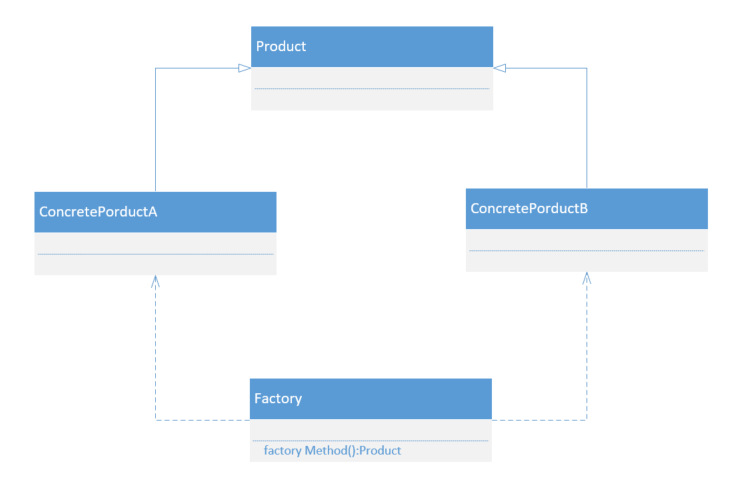
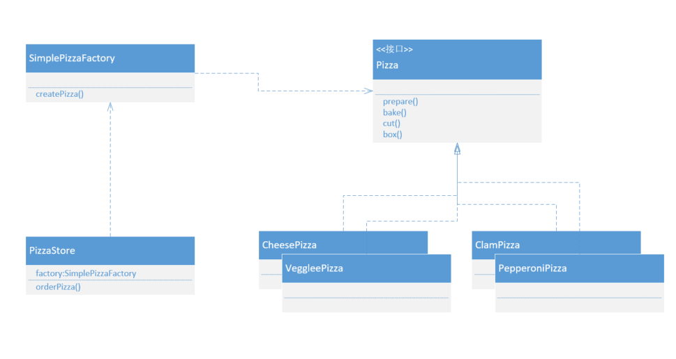

## 简单工厂

###什么是简单工厂

**设计原则中有这样一句话：应该针对接口编程，而不是针对实现编程。**而在创建对象的时候，经常使用new关键词，这不正是在针对实现编程嘛！实例化一个具体类会导致代码更脆弱，更缺乏弹性。有些时候具体需要实现哪个类，通常在运行时由一些条件来决定，这样的代码一旦有变化或扩展，就必须重新打开这段代码进行检查和修改。通常这样修改过的代码将造成部分系统更难维护和更新，而且也更容易犯错。

针对接口编程，可以隔离掉以后系统可能发生的一大堆改变。因为如果代码是针对接口编写，那么通过多态，它可以与任何新类实现该接口。但是，当代码使用大量的具体类时，针对接口编程等于自找麻烦，因为一旦加入新类，就必须改变代码。也就是说，你的代码并非对修改关闭。想用新的具体类来扩展代码，必须重新打开它。

**设计原则中还有一句话：找出应用中可能变化之处，把他们独立出来，不要和那些不需要变化的代码混在一起。**

所以我们可以将创建对象的代码从程序中独立出来移到另一个新对象中，由这个新对象专职创建对象，我们称这个新对象为工厂。工厂处理创建对象的细节。这样，将创建对象的代码封装到工厂类中，当以后实现改变时，只需修改这个工厂类即可。

我们希望在创建对象的时候调用工厂创建方法，传递一个对对象的要求参数，然后返回一个满足这个要求的具体对象，这个时候就可以成这样的工厂为简单工厂，又称之为静态工厂方法。简单工厂其实不是一个设计模式，反而比较像是一种编程习惯。

### UML类图



### UML成员

Product：抽象产品角色，为所有产品的父类。

ConcreteProduct：具体的产品角色，需要实现抽象产品角色。

Factory：工厂角色，专门用于创建实例的对象，提供一个方法，该方法根据传递参数的不同返回不同类的具体实例。

### 具体场景

在一个披萨店中，根据不同客户的口味，生产不同的披萨。



抽象披萨：

```java
public interface Pizza {
    void prepare();
    void bake();
    void cut();
    void box();
}
```

具体披萨：

```java
public class CheesePizza implements Pizza {
    @Override
    public void prepare() {
        System.out.println("prepare CheesePizza...");
    }
    @Override
    public void bake() {
        System.out.println("bake CheesePizza...");
    }
    @Override
    public void cut() {
        System.out.println("cut CheesePizza...");
    }
    @Override
    public void box() {
        System.out.println("box CheesePizza...");
    }
}
```

披萨简单工厂：

```java
public class SimplePizzaFactory {
    public Pizza createPizza(String type) {
        Pizza pizza = null;
        switch (type) {
            case "cheese":
                pizza = new CheesePizza();
                break;
            case "veggie":
                pizza = new VeggiePizza();
                break;
            case "clam":
                pizza = new ClamPizza();
                break;
            case "pepperoni":
                pizza = new PepperoniPizza();
                break;
            default:
                break;
        }
        return pizza;
    }
}
```

披萨商店：

```java
public class PizzaStore {
    SimplePizzaFactory factory;
    public PizzaStore(SimplePizzaFactory factory){
        this.factory = factory;
    }
    public Pizza orderPizza(String type) {
        Pizza pizza = factory.createPizza(type);
        pizza.prepare();
        pizza.bake();
        pizza.cut();
        pizza.box();
        return pizza;
    }
}
```

### 优点

通过使用简单工厂类，外界可以从直接创建具体产品对象的尴尬局面摆脱出来，仅仅需要负责消费对象就可以了，而不必管这些对象究竟如何创建及如何组织的，明确了各自的职责和权利，有利于整个软件体系结构的优化。

### 缺点

由于工厂类集中了所有实例的创建逻辑，违反了高内聚责任分配原则，将全部创建逻辑集中到了一个工厂类中；

工厂类所能创建的类只能是事先考虑到的，如果需要添加新的类，则需要改变工厂类；

当系统中具体产品类不断增多的时候，可能会出现要求工厂类根据不同条件船舰不同实例的需求，这种对条件的判断和对具体产品类型的判断交错在一起，很难避免模块功能的蔓延，对系统的维护和扩展非常不利。

### 使用场景

工厂类负责创建的对象比较少；

客户端只知道传入工厂类的参数，对于如何创建对象（逻辑）不关心。