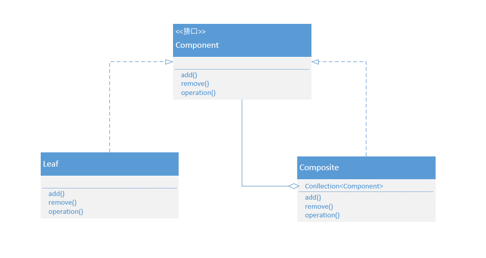
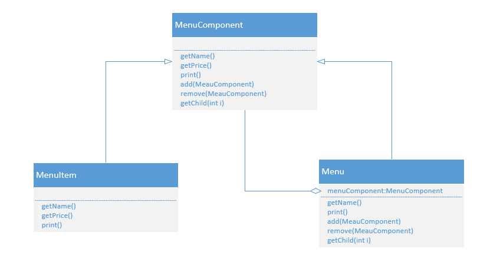

## 组合模式

### 什么是组合模式

树形结构在软件中随处可见，例如操作系统中的目录结构、应用软件中的菜单、办公系统中的公司组织结构等等。使用面向对象设计树形结构模块的时候需要考虑一个问题，树形结构从根节点向外发散的过程中有树枝节点和叶子节点，叶子节点相当于一个单独的对象，树枝节点相当于一个包含多个叶子节点的组合，而我们希望**用户在使用的过程中不单可以很直观的体现出部分于整体层次结构，还希望用户可以忽略组合对象于单个对象的不同，统一的使用树形结构中的所有对象。**

其实设计模式中有一种模式是应对这样的需求设计的，这个设计模式叫做组合模式：

**组合模式允许你将对象组合成树形结构来表现“整体/部分”层次结构。组合能让客户以一致的方式处理个别对象以及对象组合。**

那么怎样通过面向对象的思想来设计出组合模式呢？其实可以将组合模式的定义分开来看，第一句允许将对象组合成树形结构来表现层次结构，首先就可以想到，根节点和树枝节点（组合对象）是叶子节点（单个对象）的集合，组合对象应该是一个容器，可以装下多个单个对象和其他组合对象，并且应该有增删等容器的基本功能。第二句能让客户以一致的方式处理个别对象及对象组合，那么单个对象和组合对象应该有统一的接口，使得用户可以将相同的操作应用到两种对象上。

但是组合对象本质上是一个容器，它具备增删等功能，如果单个对象和组合对象实现于同一个对象，那么单个对象不是也具备了增删的功能，而单个对象的增删功能是没有意义的。所以在实现单个对象和组合对象的时候应对不同的场景可以分为两种方式：透明方式和安全方式。

透明方式是指在抽象接口中声明所有用来管理单个对象的方法，包括增删等。这样实现了抽象接口的单个对象和组合对象都具备了增删等功能。这样做的好处就是单个对象和组合对象对于外界没有任何差别，他们具备完全一致的行为接口。但问题也很明显，单个对象本身不具备增删等方法的功能，所以实现它们是没有意义的。

安全方式是指在抽象接口中不生命所有用来管理单个对象的方法。那么单个对象也不需要实现这些功能方法，而是在组合对象中声明所有用来管理单个对象的方法。随之而来的问题就是不够透明，单个对象和组合对象不具备相同的接口，客户在使用的时候需要做相应的判断。

### UML类图



### UML成员

Component：组合中对象的声明接口。

Leaf：叶子节点。定义组合内元素的行为，叶子节点没有子节点。

Composite：树枝节点。定义组件的行为，这样的组件具有子节点。

### 具体场景

实现一个菜单的树形结构



抽象接口：

```java
public abstract class MenuComponent {
    public void add(MenuComponent menuComponent) {
        throw new UnsupportedOperationException ();
    }
    public void remove(MenuComponent menuComponent) {
        throw new UnsupportedOperationException ();
    }
    public MenuComponent getChild(int i) {
        throw new UnsupportedOperationException ();
    }
    public String getName() {
        throw new UnsupportedOperationException ();
    }
    public double getPrice() {
        throw new UnsupportedOperationException ();
    }
    public void print() {
        throw new UnsupportedOperationException ();
    }
}
```

菜项类：

```java
public class MenuItem extends MenuComponent {
    private String name;
    private double price;
    public MenuItem(String name, double price) {
        this.name = name;
        this.price = price;
    }
    @Override
    public String getName() {
        return name;
    }
    @Override
    public double getPrice() {
        return price;
    }
    @Override
    public void print() {
        System.out.println("Item名称：" + name + " 价格：" + price);
    }
}
```

菜单类：

```java
public class Menu extends MenuComponent {
    private List<MenuComponent> list;
    private String name;
    public Menu(String name) {
        this.name = name;
        list = new ArrayList<> ();
    }
    @Override
    public void add(MenuComponent menuComponent) {
        list.add (menuComponent);
    }
    @Override
    public void remove(MenuComponent menuComponent) {
        list.remove (menuComponent);
    }
    @Override
    public MenuComponent getChild(int i) {
        return list.get (i);
    }
    @Override
    public String getName() {
        return name;
    }
    @Override
    public void print() {
        System.out.println("Menu名称：" + name);
    }
}
```

### 优点

- 可以清晰的定义分层次的复杂对象，表示对象的全部或部分层次，它让客户端忽略了层次的差异，方便对整个层次结构进行控制
- 客户端可以一致的使用单个对象和组合对象，不必关心处理的是单个对象还是组合对象，简化客户端代码
- 在组合模式中增加组合对象和单个对象无需对现有类库进行任何修改，符合开-闭原则
- 组合模式为树形结构的面向对象实现提供了一种灵活的解决方案，通过单个对象和组合对象的递归组合，可以形成复杂的树形结构，但对树形结构的控制却非常简单

### 缺点

- 增加新构件时很难对容器中的构件类型进行限制，因为他们都来自相同的抽象层。在这种情况下，必须通过在运行时进行类型检查来实现