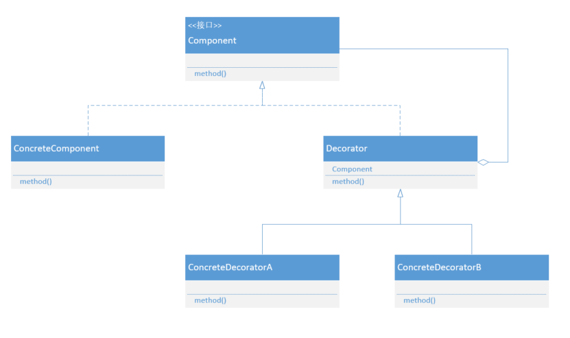
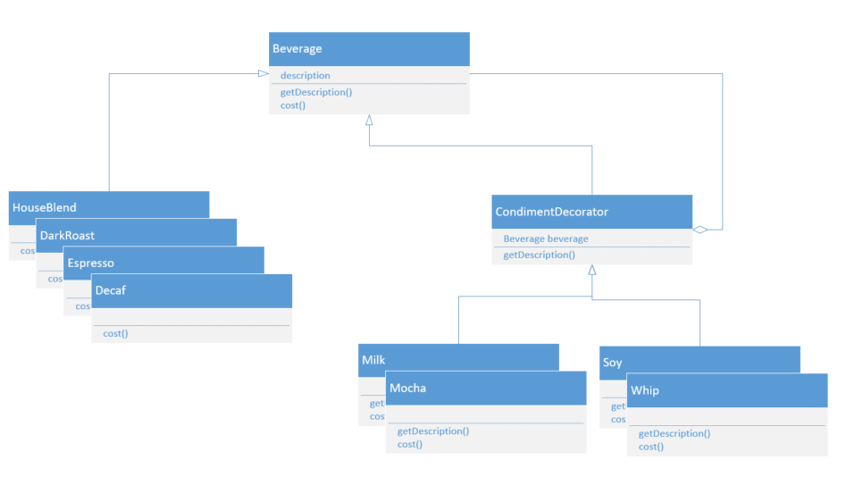

## 装饰模式

### 什么是装饰模式

玩游戏的时候经常想，给我的游戏角色穿这么多衣服，带这么多饰品到底是怎么实现的，好像可以随时随地的装饰我的角色。是怎么设计这种装饰系统的呢？

受到了java.io包的启发，可以使用装饰模式来实现这种效果。

参考io包下的类，可以总结出一些装饰模式的条件：

- 装饰者和被装饰者对象有相同的超类型
- 可以用一个或多个装饰者包装一个对象
- 既然装饰者和被装饰对象有相同的超类型，所以在任何需要原始对象（被包装的）的场合，可以用装饰过的对象代替它
- 装饰者可以在所委托被装饰者的行为之前或之后，加上自己的行为，已达到特定的目的
- 对象可以在任何时候被装饰，所以可以在运行时动态的、不限量的用装饰者来装饰对象

**装饰模式动态的将责任附加到对象上。若要扩展功能，装饰者提供了比继承更有弹性的替代方案。**

### UML类图



### UML成员

Component：抽象组件。每个组件都可以单独使用，或者被装饰者包装使用。

ConcreteComponent：具体组件。可以动态给他添加职责。

Decorator：抽象装饰类。继承Component组件，从外类来扩展Component类的功能，但对于Component来说，无需知道Decorator的存在。并且有一个Component组件。

ConcreteDecorator：具体装饰类。可以给Component组件添加职责。

### 具体场景

为星巴克设计一套计算价格和显示描述的咖啡系统，咖啡中可以随意添加调料。



抽象组件：

```java
public abstract class Beverage {
    protected String description = "Unknown Beverage";
    public String getDescription() {
        return description;
    }
    public abstract double cost();
}
```

具体组件：

```java
public abstract class Beverage {
    protected String description = "Unknown Beverage";
    public String getDescription() {
        return description;
    }
    public abstract double cost();
}
public class DarkRoast extends Beverage {
    public DarkRoast() {
        description = "Dark Roast Coffee";
    }
    @Override
    public double cost() {
        return 0.99;
    }
}
public class Decaf extends Beverage {
    public Decaf() {
        description = "Decaf Coffee";
    }
    @Override
    public double cost() {
        return 2.99;
    }
}
public class Espresso extends Beverage {
    public Espresso() {
        description = "Espresso Coffee";
    }
    @Override
    public double cost() {
        return 1.99;
    }
}
```

抽象饰品类：

```java
public abstract class CondimentDecorator extends Beverage {
    protected Beverage beverage;
    public abstract String getDescription();
}
```

具体饰品类：

```java
public class Milk extends CondimentDecorator {
    public Milk(Beverage beverage) {
        this.beverage = beverage;
    }
    @Override
    public String getDescription() {
        return beverage.getDescription () + ",Milk";
    }
    @Override
    public double cost() {
        return 0.1 + beverage.cost ();
    }
}
public class Mocha extends CondimentDecorator {
    public Mocha(Beverage beverage) {
        this.beverage = beverage;
    }
    @Override
    public String getDescription() {
        return beverage.getDescription () + ",Mocha";
    }

    @Override
    public double cost() {
        return 0.2 + beverage.cost ();
    }
}
```

客户端：

```java
public class Client {
    public static void main(String args[]) {
        Beverage beverage = new HouseBlend ();
        System.out.println(beverage.getDescription () + " $" + beverage.cost ());

        Beverage beverage1 = new Espresso ();
        beverage1 = new Milk (beverage1);
        beverage1 = new Mocha (beverage1);
        System.out.println(beverage1.getDescription () + " $" + beverage1.cost ());
    }
}
```

### 优点

- 装饰模式提供比继承更多的灵活性
- 可以通过一种动态的方式扩展一个对象功能，在运行时选择不同的装饰器，从而实现不同的行为
- 可以通过使用不同的具体装饰类以及这些装饰类的排列组合，创造出很多不同行为的组合
- 具体组件与具体装饰类可以独立变化，增加新的具体构建和具体装饰类，使用时对其进行组合，源代码无需改变，符合开-闭原则

### 缺点

- 会产生许多小对象，增加系统复杂性
- 更容易出现错误，不易排查