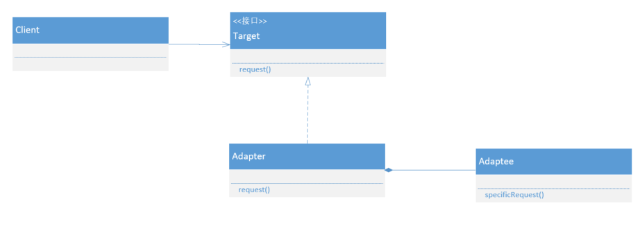
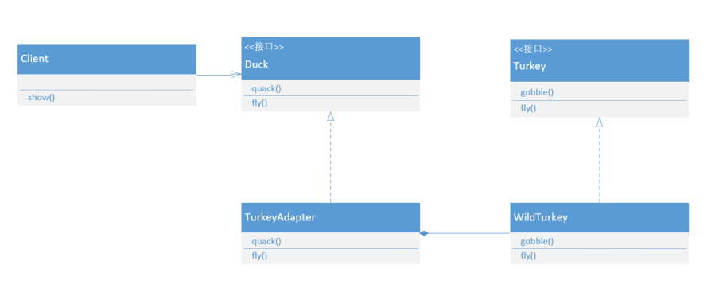

## 适配器模式

### 什么是适配器模式

网络购物让现在的商品交易消除了距离感。有时候我们会买一些国外的商品，比如日本直邮的PS4，但是有一个比较棘手的问题就是两国使用的电线插头规格是不一样的，日本直邮的PS4插头适配不了中国的插座。这时候我们需要在万能的淘宝上买一个转换头，一边可以插在中国的插座上，一边可以接受日本规格的插头，这样我们就可以愉快的打游戏了。这个转换头学名就是适配器，而这种转换的方式就叫做适配器模式。

其实程序中我们经常要接触到适配器模式的。比如，有一个办公软件系统，在给不同的客户公司使用的时候会按照客户的要求使用不同的数据库，我们知道数据库的不同可能导致接口的差异，难道我们要重新写一套对应新数据库的接口吗？答案是否定的，不管从成本上还是维护上来说都不能允许我们这么干。那么，适配器模式需要出马了，将这个新的库接口转换成我们所需要的接口。

**适配器模式将一个类的接口，转换成客户期望的另一个接口。适配器让原本接口不兼容的类可以互作无间。**

客户端使用适配器的过程如下：

- 客户端通过目标接口调用适配器的方法对适配器发出请求
- 适配器使用被适配者接口把请求转换成被适配者的一个或多个调用接口
- 客户端接收到调用的结果，但并未察觉这一切是适配器在起转换作用

这个模式可以通过创建适配器进行接口转换，让不兼容的接口变成兼容。这可以让客户从实现的接口解耦。如果在一段时间后，我们要改变接口，适配器可以将改变的部分封装起来，客户就不必为了应对不同的接口而每次跟着改变。

### UML类图



### UML成员

Target：抽象目标适配器。定义提供给客户端的接口

Adapter：适配器类。实现目标适配器接口

Adaptee：被适配器类。

### 具体场景

森林要举行一年一度的跨年晚会，鸭子家出了一场群体舞蹈表演。可是临到上场表演的时候发现小儿子生病不能上场了，于是鸭子爸爸找到了好朋友火鸡先生帮忙客串下。可是火鸡先生的动作不像鸭子怎么办？现在帮助鸭子爸爸出个主意。



目标接口Duck：

```java
public interface Duck {
    void quack();
    void fly();
}
```

被适配者接口Turkey：

```java
public interface Turkey {
    void gobble();
    void fly();
}
```

被适配者具体类WildTurkey：

```java
public class WildTurkey implements Turkey {
    @Override
    public void gobble() {
        System.out.println("gobble gobble");
    }
    @Override
    public void fly() {
        System.out.println("flying a short distance");
    }
}
```

适配器类TurkeyAdapter：

```java
public class TurkeyAdapter implements Duck {
    private Turkey turkey;
    public TurkeyAdapter(Turkey turkey) {
        this.turkey = turkey;
    }
    @Override
    public void quack() {
        turkey.gobble ();
    }
    @Override
    public void fly() {
        for (int i = 0; i < 5; i ++) {
            turkey.fly ();
        }
    }
}
```

正常鸭子成员：

```java
public class RedDuck implements Duck {
    @Override
    public void quack() {
        System.out.println("quack quack");
    }
    @Override
    public void fly() {
        System.out.println("flying");
    }
}
```

客户端：

```java
public class Client {
    public static void show(Duck duck) {
        duck.quack ();
        duck.fly ();
    }
    public static void main(String args[]) {
        Duck dad = new RedDuck ();
        Duck mom = new RedDuck ();
        Turkey turkey = new WildTurkey ();
        Duck wild = new TurkeyAdapter (turkey);
        List<Duck> team = new ArrayList<> ();
        team.add (dad);
        team.add (mom);
        team.add (wild);
        team.forEach (duck -> show (duck));
    }
}
```

### 优点

- 将目标类和被适配者解耦，通过使用适配器让不兼容的接口变得兼容。
- 增加了类的透明性和复用性，将具体的实现封装在适配器类中，对于客户端类来说是透明的，而且提高了被适配者的复用性。
- 灵活性和扩展性强，在不修改已有代码的基础上增加新的适配器类，符合开-闭原则。

### 缺点

- 一次只能适配一个被适配者类，不能同时适配多个适配者。

